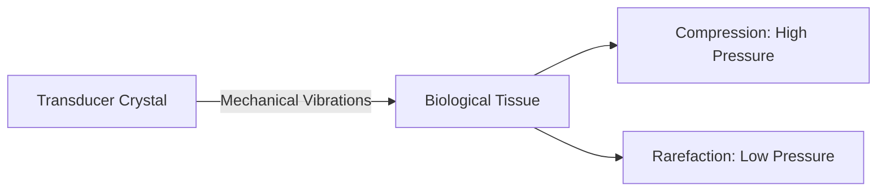
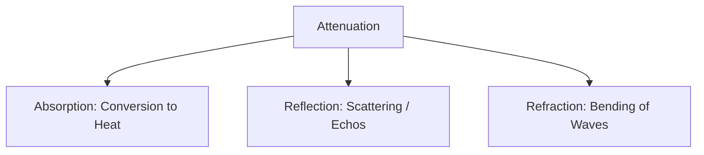

To use ultrasound safely and effectively, you must understand the basic physics of sound wave propagation in human tissue.

## What is Ultrasound?

Ultrasound is any acoustic (sound) energy with a frequency above the upper limit of human hearing, which is **20,000 Hertz (20 kHz)**.

In clinical diagnostics, we typically operate in the range of **2 Megahertz (MHz) to 20 Megahertz (MHz)**.

### Wave Characteristics

Sound waves are longitudinal, mechanical waves. They require a medium to travel (unlike electromagnetic waves) and consist of alternating cycles of:

- **Compression:** High pressure, high density.
- **Rarefaction:** Low pressure, low density.

---

## Key Principles of Propagation

### 1. Velocity (Speed of Sound)

The velocity of sound ($c$) is determined solely by the **medium** through which it travels. It is governed by two properties of the medium:

- **Stiffness (Bulk Modulus):** As stiffness increases, velocity increases.
- **Density:** As density increases, velocity decreases.

In human soft tissue, the average velocity of sound is assumed to be **1,540 m/s**.

:::note[Velocity of Sound in Different Media]
| Medium | Speed of Sound (m/s) |
| :--- | :--- |
| **Air** | 330 m/s |
| **Water** | 1,480 m/s |
| **Soft Tissue** (Average) | **1,540 m/s** |
| **Bone** | 4,080 m/s |
:::

### 2. Acoustic Impedance

Acoustic impedance ($Z$) is the resistance offered by a medium to the passage of sound waves. It is calculated as:

$$
Z = \rho \times c
$$

Where:

- $\rho$ is the density of the medium.
- $c$ is the velocity of sound in the medium.

#### Reflection at Boundaries

When sound travels through a boundary between two media with different acoustic impedances, a portion of the wave is **reflected** back to the transducer as an echo. The remainder of the wave is **transmitted** deeper.

- **Large Impedance Difference:** Highly reflective boundary (e.g., Soft tissue to Bone or Soft tissue to Air). This results in a strong echo and shadowing behind it.
- **Small Impedance Difference:** Highly transmissive boundary (e.g., Liver to Kidney). Most of the wave passes through.

---

## Attenuation

Attenuation is the gradual loss of wave energy as it travels through a medium. It increases with:

1. **Depth:** The further the sound travels, the more energy is lost.
2. **Frequency:** Higher frequency sound attenuates much faster than lower frequency sound.

:::warning[The Trade-off]

- **High Frequency (10 - 20 MHz):** Excellent spatial resolution but poor penetration (depth). Ideal for superficial structures (e.g., vessels, thyroid, nerves).
- **Low Frequency (2 - 5 MHz):** Poor spatial resolution but excellent penetration. Ideal for deep structures (e.g., abdomen, cardiac, obstetrics).
  :::
