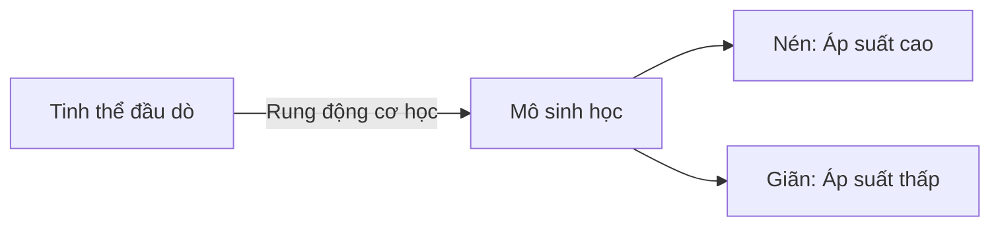
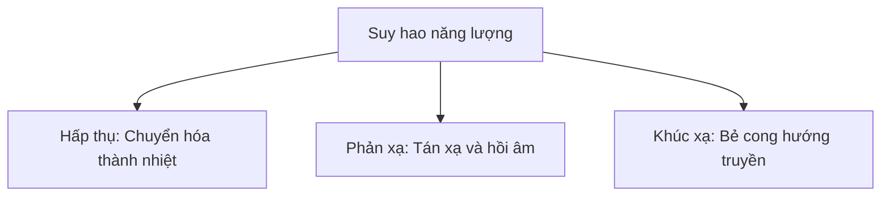

Để sử dụng siêu âm một cách an toàn và hiệu quả trong thực hành lâm sàng, việc nắm vững các nguyên lý vật lý cơ bản của sự truyền sóng âm trong mô người là yêu cầu tiên quyết.

## Khái niệm Siêu âm

Siêu âm là năng lượng âm thanh có tần số vượt quá giới hạn nghe được của tai người, tức là lớn hơn **20.000 Hz (20 kHz)**.

Trong chẩn đoán y khoa, tần số thường được sử dụng dao động trong dải từ **2 MHz đến 20 MHz**.

**Bản chất của sóng siêu âm** là sóng cơ học dọc. Chúng cần môi trường vật chất để truyền đi và bao gồm các chu kỳ luân phiên của:

- **Sự nén (Compression):** Vùng áp suất cao, mật độ mô cao.
- **Sự giãn (Rarefaction):** Vùng áp suất thấp, mật độ mô thấp.

---

## Các Nguyên lý Truyền Sóng Cốt lõi

### 1. Vận tốc Truyền âm

Vận tốc truyền âm ($c$) được quyết định bởi đặc tính của môi trường mà sóng âm đi qua, chi phối bởi 2 yếu tố:

- **Độ cứng (Bulk Modulus):** Độ cứng của môi trường càng tăng thì vận tốc truyền âm càng tăng.
- **Mật độ (Density):** Mật độ môi trường càng tăng thì vận tốc truyền âm càng giảm.

Trong mô mềm của cơ thể người, vận tốc truyền âm trung bình được quy ước chuẩn là **1540 m/s**.

| Môi trường | Tốc độ truyền âm (m/s) |
| :--- | :--- |
| **Không khí** | 330 |
| **Nước** | 1480 |
| **Mô mềm** (Trung bình) | **1540** |
| **Xương** | 4080 |

### 2. Trở kháng Âm

Trở kháng âm ($Z$) đại diện cho sức cản của môi trường đối với sự truyền đi của sóng âm, tính bằng công thức:

$$
Z = \rho \times c
$$

Trong đó:
- $\rho$ là mật độ của môi trường.
- $c$ là vận tốc truyền âm trong môi trường đó.

#### Phản xạ tại Bề mặt Phân cách

Khi chùm siêu âm đi qua mặt phân cách giữa 2 môi trường có trở kháng âm khác nhau ($Z_1 \neq Z_2$), một phần năng lượng âm sẽ phản xạ ngược về đầu dò tạo thành tín hiệu hồi âm (echo), phần còn lại tiếp tục truyền sâu vào lớp mô phía dưới.

- **Chênh lệch trở kháng âm lớn ($\Delta Z$ lớn):** Phản xạ gần như toàn bộ chùm âm. Ví dụ: Giao diện Mô mềm - Xương hoặc Mô mềm - Không khí. Hệ quả tạo ra vùng hồi âm rất mạnh kèm bóng lưng phía sau.
- **Chênh lệch trở kháng âm nhỏ ($\Delta Z$ nhỏ):** Phần lớn chùm âm truyền qua, chỉ một phần nhỏ quay về đầu dò. Ví dụ: Bề mặt tiếp xúc Gan - Thận.

---

## Sự Suy hao Sóng âm

Sự suy hao (attenuation) là sự giảm dần năng lượng của sóng âm khi truyền qua môi trường mô. Sự suy hao tăng lên theo:

1. **Độ sâu:** Sóng âm truyền càng xa, năng lượng mất mát càng nhiều.
2. **Tần số:** Tần số sóng âm càng cao thì mức độ suy hao càng nhanh.

:::note[Mối tương quan Tần số và Độ phân giải]
- **Tần số cao (10–20 MHz):** Độ phân giải không gian cao nhưng độ đâm xuyên nông. Thích hợp cho các cấu trúc nông (tuyến giáp, mạch máu nông, mô mềm nông).
- **Tần số thấp (2–5 MHz):** Độ phân giải thấp hơn nhưng độ đâm xuyên sâu. Thích hợp cho các cấu trúc nằm sâu (ổ bụng, sản khoa, tim mạch).
:::
