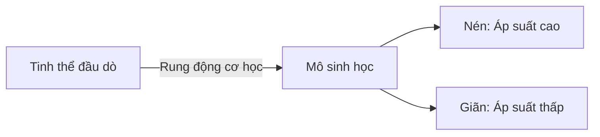
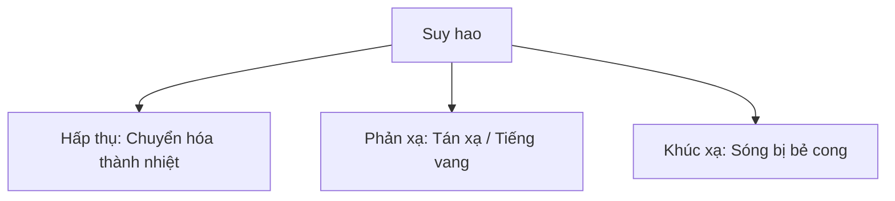

Để sử dụng siêu âm một cách an toàn và hiệu quả, bạn phải hiểu các nguyên lý vật lý cơ bản của sự truyền sóng âm trong mô người.

## Siêu âm là gì?

Siêu âm là bất kỳ năng lượng âm thanh nào có tần số vượt quá giới hạn nghe được của con người, tức là trên **20.000 Hertz (20 kHz)**.

Trong chẩn đoán lâm sàng, chúng ta thường làm việc trong dải tần số từ **2 Megahertz (MHz) đến 20 Megahertz (MHz)**.

### Bản chất của Sóng Siêu âm

Sóng âm là sóng cơ học dọc. Chúng cần một môi trường để truyền đi (không giống như sóng điện từ) và bao gồm các chu kỳ luân phiên của:

- **Sự nén (Compression):** Áp suất cao, mật độ cao.
- **Sự giãn (Rarefaction):** Áp suất thấp, mật độ thấp.

---

## Các Nguyên lý Truyền Sóng Cốt lõi

### 1. Vận tốc (Tốc độ truyền âm)

Vận tốc truyền âm ($c$) được quyết định hoàn toàn bởi **môi trường** mà nó đi qua. Nó bị chi phối bởi hai thuộc tính của môi trường:

- **Độ cứng (Sức cản nén - Bulk Modulus):** Độ cứng càng tăng thì vận tốc càng tăng.
- **Mật độ (Khối lượng riêng):** Mật độ càng tăng thì vận tốc càng giảm.

Trong mô mềm của con người, vận tốc trung bình của âm thanh được giả định là **1.540 m/s**.

:::note[Tốc độ truyền âm trong các môi trường khác nhau]
| Môi trường | Tốc độ truyền âm (m/s) |
| :--- | :--- |
| **Không khí** | 330 m/s |
| **Nước** | 1.480 m/s |
| **Mô mềm** (Trung bình) | **1.540 m/s** |
| **Xương** | 4.080 m/s |

:::

### 2. Trở kháng âm

Trở kháng âm ($Z$) là sức cản của môi trường đối với sự đi qua của sóng âm. Nó được tính bằng công thức:

$$
Z = \rho \times c
$$

Trong đó:

- $\rho$ là mật độ của môi trường.
- $c$ is vận tốc truyền âm trong môi trường đó.

#### Phản xạ tại bề mặt phân cách

Khi chùm siêu âm truyền qua mặt phân cách giữa hai môi trường có trở kháng âm khác nhau ($Z_1 \neq Z_2$), một phần năng lượng âm sẽ phản xạ ngược lại đầu dò tạo thành tín hiệu hồi âm (echo), phần năng lượng còn lại sẽ khúc xạ/truyền tiếp vào lớp mô sâu hơn.

Chênh lệch trở kháng âm RẤT LỚN ($\Delta Z$ lớn): Phản xạ gần như toàn bộ chùm âm. Ví dụ: Giao diện Mô mềm - Xương hoặc Mô mềm - Không khí. Hệ quả: Tạo ra vùng hồi âm rất mạnh kèm bóng lưng sạch/bẩn phía sau.
Chênh lệch trở kháng âm NHỎ ($\Delta Z$ nhỏ): Phần lớn chùm âm đi xuyên qua, chỉ một lượng nhỏ quay về đầu dò. Ví dụ: Bề mặt tiếp xúc giữa Gan - Thận. System dựng nên hình ảnh mô phỏng ranh giới rõ nét mà vẫn khảo sát được tạng nằm sâu.

---

## Sự giảm thế năng âm

Sự giảm thế năng âm là sự mất mát dần năng lượng của sóng âm khi nó truyền qua môi trường. Nó tăng lên theo:

1. **Độ sâu:** Sóng âm truyền càng xa thì năng lượng mất đi càng nhiều.
2. **Tần số:** Sóng âm có tần số cao hơn sẽ suy hao nhanh hơn nhiều so với sóng âm có tần số thấp hơn.

:::warning[Sự đánh đổi]

- **Tần số cao (10 - 20 MHz):** Độ phân giải không gian tuyệt vời nhưng độ đâm xuyên kém (nông). Lý tưởng cho các cấu trúc nông (ví dụ: mạch máu, tuyến giáp, dây thần kinh).
- **Tần số thấp (2 - 5 MHz):** Độ phân giải không gian kém hơn nhưng độ đâm xuyên tuyệt vời. Lý tưởng cho các cấu trúc nằm sâu (ví dụ: ổ bụng, tim mạch, sản khoa).

:::
