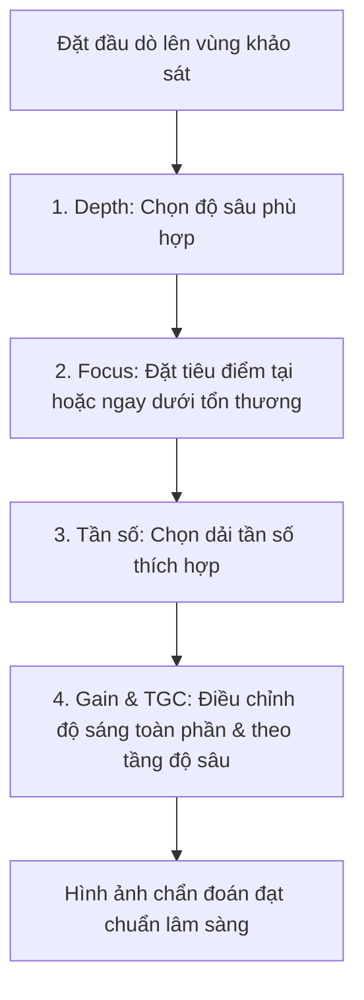

## Tổng quan

Tối ưu hóa hình ảnh siêu âm (Knobology) là kỹ năng chủ động điều chỉnh các phím điều khiển trên máy siêu âm nhằm đạt được hình ảnh rõ nét nhất, phục vụ chính xác cho quá trình chẩn đoán lâm sàng.

---

## Kỹ thuật Điều chỉnh Phím Tối ưu Cốt lõi

Để có được hình ảnh siêu âm đạt chuẩn, bác sĩ cần điều chỉnh 5 thông số kỹ thuật cốt lõi theo thứ tự logic:

### 1. Độ sâu (Depth)

Độ sâu quyết định trường nhìn (Field of View) và ảnh hưởng trực tiếp đến **Tốc độ khung hình (Frame Rate)**.

- **Nguyên tắc chuẩn:** Cấu trúc mục tiêu cần khảo sát nên chiếm khoảng **70–80% chiều cao màn hình**.
- **Quá nông:** Không quan sát được các cấu trúc phía sau mục tiêu, dễ bỏ sót bệnh lý ở lớp sâu.
- **Quá sâu:** Cấu trúc mục tiêu bị thu nhỏ, đồng thời tốc độ khung hình giảm do thời gian sóng âm đi và về kéo dài.

### 2. Tiêu điểm (Focus)

Tiêu điểm giúp tối ưu hóa độ phân giải ngang (lateral resolution) bằng cách thu hẹp chùm tia siêu âm tại độ sâu mong muốn.

- **Cài đặt tối ưu:** Đặt ký hiệu tiêu điểm (focus marker) **tại hoặc ngay dưới bờ dưới** của cấu trúc cần khảo sát.
- Tránh cài đặt quá nhiều tiêu điểm cùng lúc vì sẽ làm giảm tốc độ khung hình (độ phân giải thời gian).

### 3. Độ khuếch đại toàn phần (Overall Gain)

Gain toàn phần giúp khuếch đại tất cả tín hiệu phản hồi (echo) trở về một cách đồng đều trên toàn bộ màn hình.

- **Thiếu Gain (Under-gained):** Màn hình quá tối, mất các chi tiết cấu trúc âm mịn của nhu mô.
- **Thừa Gain (Over-gained):** Màn hình quá sáng, gây lóa và xóan nhòa các ranh giới tổn thương nhỏ.

### 4. Bù trừ Khuếch đại theo Thời gian (TGC)

Do sóng âm bị suy hao dần khi truyền vào sâu, tín hiệu phản hồi từ cấu trúc sâu sẽ yếu hơn cấu trúc nông. **TGC (Time-Gain Compensation)** cho phép điều chỉnh Gain riêng biệt ở các tầng độ sâu khác nhau.

- **Cài đặt tối ưu:** Điều chỉnh các thanh gạt TGC thành một đường cong mượt mà từ trái sang phải (khuếch đại tăng dần từ nông đến sâu) để hình ảnh nhu mô có độ sáng đồng nhất từ nông tới sâu.

### 5. Tần số Đầu dò (Frequency)

Đối với các đầu dò đa tần số, bác sĩ có thể thay đổi dải tần phát ra tùy thuộc vào thể trạng bệnh nhân:

- **Tăng tần số (Chế độ Resolution):** Tăng độ phân giải chi tiết, phù hợp với người bệnh thể trạng gầy hoặc tổn thương vùng nông.
- **Giảm tần số (Chế độ Penetration):** Tăng độ đâm xuyên, phù hợp với người bệnh béo phì hoặc tổn thương nằm ở lớp sâu.

---

## Tiêu chuẩn Đánh giá Xảo ảnh (Nhiễu ảnh) Thường gặp

Xảo ảnh (artifacts) là những hình ảnh hiển thị trên màn hình không tương ứng với cấu trúc giải phẫu thực tế. Việc nhận biết xảo ảnh giúp tránh chẩn đoán sai lầm.

### 1. Bóng lưng (Acoustic Shadowing)

Xuất hiện phía sau cấu trúc có độ hấp thụ hoặc phản xạ âm rất mạnh (sỏi mật, xương, nốt vôi hóa). Chùm âm không thể truyền qua, tạo ra một dải tối (trống âm) phía sau.

### 2. Tăng cường Âm Phía sau (Posterior Acoustic Enhancement)

Xuất hiện phía sau cấu trúc có độ suy hao âm rất yếu (nang dịch, bàng quang, túi mật chứa dịch). Sóng âm đi qua dịch mất ít năng lượng hơn mô xung quanh, làm vùng mô phía sau hiển thị sáng hơn (tăng âm) một cách giả tạo. Đây là tiêu chuẩn quan trọng để xác nhận tổn thương dạng nang.

### 3. Dội lại (Reverberation)

Xuất hiện khi sóng âm bị phản xạ nhiều lần giữa 2 bề mặt song song có trở kháng âm chênh lệch lớn. Biểu hiện là các đường tăng âm song song cách đều nhau (như đường A-line trong siêu âm phổi).

### 4. Soi gương (Mirror Image)

Xuất hiện khi chùm âm gặp một bề mặt phản xạ mạnh dạng cong (như cơ hoành). Sóng âm dội qua lại giữa tổn thương thực và cơ hoành trước khi về đầu dò, tạo ra một hình ảnh giả đối xứng nằm ở phía bên kia cơ hoành.
