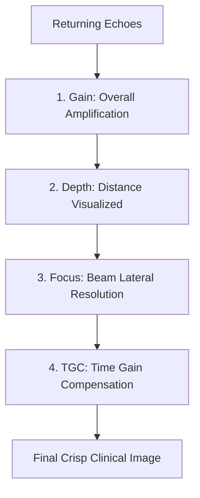

"Knobology" refers to the study and manipulation of the controls on an ultrasound machine. Optimization is the active process of adjusting these knobs to maximize diagnostic clarity.

## The Core Optimization Knobs

To get the best possible image, a sonographer or clinical scanner must continuously adjust these five essential settings:

---

### 1. Overall Gain
Overall Gain amplifies all returning echo signals equally, regardless of the depth they originated from.
* **Under-gained:** Image is too dark; real anatomical echoes can be missed.
* **Over-gained:** Image is too bright (whitewashed); subtle lesions or borders are obliterated by acoustic noise.

### 2. Time-Gain Compensation (TGC)
Because sound attenuates as it travels deeper, echoes from deep structures return much weaker than echoes from superficial structures. **TGC** allows you to adjust gain at specific depths.
* Typically represented as a vertical column of sliding pods.
* **Optimal Setup:** Adjust sliding pods into a smooth diagonal slope starting left (less amplification for shallow tissues) and moving right (greater amplification for deeper tissues).

### 3. Depth
Depth controls the field of view in the vertical plane.
* **Rule of Thumb:** Your target structure should occupy approximately **70-80% of the screen**.
* **Too shallow:** You cannot see structures deep to your target (missing pathology).
* **Too deep:** The target is too small to inspect, and frame rate drops because the machine wastes time waiting for echoes to return from unnecessary depths.

### 4. Focus
Focus controls the lateral resolution by narrowing the ultrasound beam width at a specific depth.
* **Optimal Setup:** Place the focus marker **at or slightly below** the depth of your target structure.
* Multiple focal zones can be used but will decrease the frame rate (temporal resolution).

---

## Common Acoustic Artifacts

Artifacts are visual representations on the screen that do not correspond to actual anatomical structures. Recognising artifacts can prevent misdiagnoses.

<Accordion>
  <AccordionItem title="Acoustic Shadowing">
    Occurs deep to a highly attenuating or reflecting structure (like bone, gallstones, or calcifications). Sound waves cannot penetrate, leaving a completely dark (anechoic) void behind the structure.
  </AccordionItem>
  <AccordionItem title="Acoustic Enhancement">
    Occurs deep to a weakly attenuating structure (typically fluid-filled organs like the gallbladder or urinary bladder). Since little energy is lost traveling through the fluid, the echoes returning from the tissue behind it are artificially bright. This proves the structure is cystic/fluid-filled!
  </AccordionItem>
  <AccordionItem title="Reverberation">
    Occurs when a sound wave gets trapped bouncing back and forth between two highly reflective parallel surfaces. Displays as multiple equally-spaced horizontal lines (e.g., A-lines in a normal lung scan).
  </AccordionItem>
  <AccordionItem title="Mirror Image">
    Occurs when the ultrasound beam hits a highly reflective curved boundary (like the diaphragm). The sound bounces off the curve, hits a real structure, bounces back to the diaphragm, and returns to the transducer. The machine thinks the path was linear and draws a duplicate structure deep to the boundary.
  </AccordionItem>
</Accordion>
