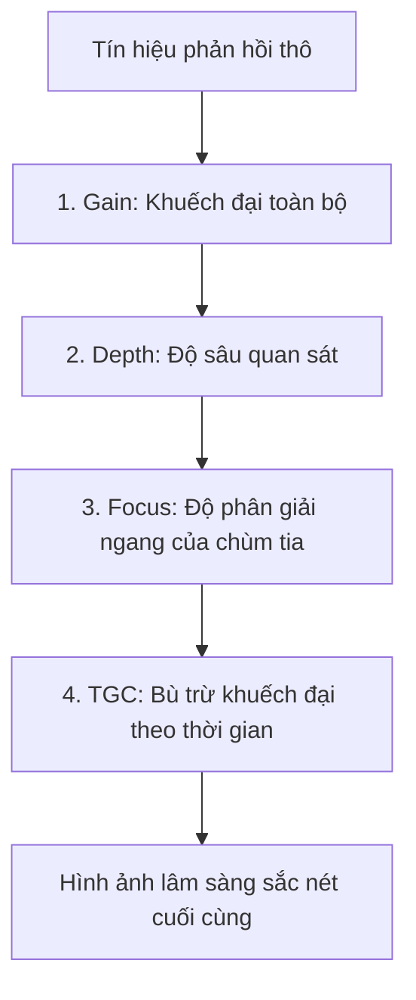

"Knobology" đề cập đến việc nghiên cứu và sử dụng thành thạo các nút điều khiển trên máy siêu âm. Tối ưu hóa là quá trình chủ động điều chỉnh các phím này để tối đa hóa độ rõ nét của hình ảnh chẩn đoán.

## Các Phím Điều chỉnh Tối ưu hóa Cốt lõi

Để có được hình ảnh tốt nhất có thể, người làm siêu âm phải liên tục điều chỉnh 5 thông số thiết yếu sau:

---

### 1. Gain toàn phần (Overall Gain)

Gain toàn phần khuếch đại tất cả các tín hiệu phản hồi (echo) trở về một cách đồng đều, bất kể chúng bắt nguồn từ độ sâu nào.

- **Thiếu Gain (Under-gained):** Hình ảnh quá tối; có thể bỏ sót các tín hiệu phản hồi thực tế của giải phẫu.
- **Thừa Gain (Over-gained):** Hình ảnh quá sáng (bị lóa/trắng xóa); các tổn thương hoặc ranh giới tinh tế bị xóa nhòa bởi nhiễu âm thanh.

### 2. Bù trừ độ khuếch đại theo thời gian (TGC - Time-Gain Compensation)

Vì sóng âm bị suy hao khi truyền vào sâu hơn, các tín hiệu phản hồi từ cấu trúc sâu trở về sẽ yếu hơn nhiều so với từ cấu trúc nông. **TGC** cho phép bạn điều chỉnh gain ở các độ sâu cụ thể.

- Thường được biểu diễn dưới dạng một cột dọc gồm các thanh gạt (sliding pods).
- **Cài đặt tối ưu:** Điều chỉnh các thanh gạt thành một đường chéo mượt mà bắt đầu từ bên trái (khuếch đại ít hơn cho mô nông) và hướng dần sang bên phải (khuếch đại nhiều hơn cho mô sâu hơn).

### 3. Độ sâu (Depth)

Độ sâu điều khiển trường quan sát (field of view) theo mặt phẳng thẳng đứng.

- **Quy tắc vàng:** Cấu trúc mục tiêu cần khảo sát nên chiếm khoảng **70-80% màn hình**.
- **Quá nông (Too shallow):** Bạn không thể nhìn thấy các cấu trúc nằm sâu hơn mục tiêu (bỏ sót bệnh lý).
- **Quá sâu (Too deep):** Mục tiêu trở nên quá nhỏ để quan sát kỹ, và tốc độ khung hình (frame rate) bị giảm do máy mất thời gian chờ tín hiệu phản hồi trở về từ những độ sâu không cần thiết.

### 4. Tiêu điểm (Focus)

Focus kiểm soát độ phân giải ngang (lateral resolution) bằng cách thu hẹp chiều rộng chùm tia siêu âm tại một độ sâu cụ thể.

- **Cài đặt tối ưu:** Đặt dấu chỉ báo tiêu điểm (focus marker) **tại hoặc ngay dưới** độ sâu của cấu trúc mục tiêu.
- Có thể sử dụng nhiều vùng tiêu điểm (multi-focus) nhưng điều này sẽ làm giảm tốc độ khung hình (độ phân giải thời gian).

---

## Các Nhiễu ảnh (Xảo ảnh) Thường gặp

Xảo ảnh (Artifacts) là những hình ảnh hiển thị trên màn hình mà không tương ứng với các cấu trúc giải phẫu thực tế. Nhận biết được xảo ảnh giúp ngăn ngừa việc chẩn đoán sai.

<Accordion>
  <AccordionItem title="Bóng lưng bên dưới (Acoustic Shadowing)">
    Xảy ra ở phía sau một cấu trúc có độ suy hao hoặc phản xạ rất mạnh (như xương, sỏi mật, hoặc các
    nốt vôi hóa). Sóng siêu âm không thể xuyên qua, để lại một khoảng trống hoàn toàn tối (trống âm)
    phía sau cấu trúc đó.
  </AccordionItem>
  <AccordionItem title="Tăng âm phía sau (Acoustic Enhancement)">
    Xảy ra ở phía sau một cấu trúc có độ suy hao âm rất yếu (thường là các cơ quan chứa dịch như túi
    mật hoặc bàng quang). Do mất rất ít năng lượng khi truyền qua dịch, các sóng âm phản hồi từ các
    mô phía sau nó trở nên sáng hơn một cách nhân tạo. Điều này giúp chứng minh cấu trúc đó là dạng
    nang/chứa dịch!
  </AccordionItem>
  <AccordionItem title="Dội lại (Reverberation)">
    Xảy ra khi sóng âm bị "bẫy" và nảy qua nảy lại giữa hai bề mặt song song có tính phản xạ cao.
    Hiển thị dưới dạng nhiều đường ngang cách đều nhau (ví dụ: các đường A-line trong siêu âm phổi
    bình thường).
  </AccordionItem>
  <AccordionItem title="Hình ảnh soi gương (Mirror Image)">
    Xảy ra khi chùm tia siêu âm gặp một ranh giới cong có tính phản xạ mạnh (như cơ hoành). Sóng âm
    dội lại từ ranh giới cong, va vào một cấu trúc thực tế, dội ngược lại cơ hoành và trở về đầu dò.
    Máy siêu âm giả định đường đi là thẳng và vẽ một cấu trúc giả đối xứng sâu hơn qua ranh giới đó.
  </AccordionItem>
</Accordion>
