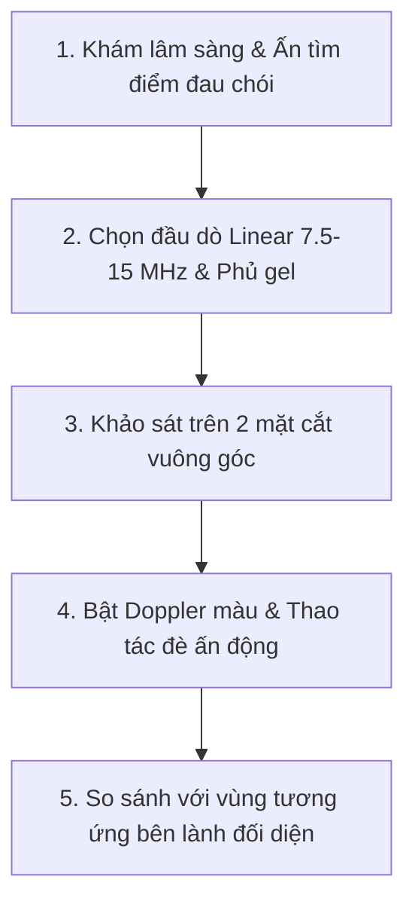

## Tổng quan

Siêu âm mô mềm là kỹ thuật chẩn đoán hình ảnh bề mặt quan trọng, được ứng dụng rộng rãi trong y học thể thao, cấp cứu (POCUS), ngoại khoa và chẩn đoán hình ảnh tổng quát. Khảo sát mô mềm đòi hỏi sự kết hợp giữa kiến thức giải phẫu siêu âm (sonoanatomy), kỹ năng điều chỉnh máy và thăm khám lâm sàng.1

---

## Chỉ định & Phạm vi Khảo sát

Siêu âm mô mềm được chỉ định trong các trường hợp sau:
- **Nhiễm trùng mô mềm:** Viêm mô tế bào, áp xe mô mềm, viêm gân/bao gân mủ, viêm cân mạc hoại tử (necrotizing fasciitis).
- **Chấn thương:** Rách/đứt gân cơ, tụ máu (nội cơ hoặc ngoại cơ), bong gân, tổn thương tụ dịch Seroma Morel-Lavallée.
- **Khối mô mềm lành tính:** U mỡ (_lipoma_), u nang bã/nang thượng bì, u mạch máu (_hemangioma_), u thần kinh (_schwannoma_), nang bao hoạt dịch.
- **Dị vật mô mềm:** Phát hiện và định vị dị vật (gỗ, thủy tinh, kim loại) kèm phản ứng viêm hạt xung quanh.
- **Khối mô mềm nghi ngờ ác tính:** Đánh giá các dấu hiệu nghi ngờ _sarcoma_ mô mềm để định hướng sinh thiết.

---

## Chuẩn bị & Kỹ thuật Khảo sát

### 1. Chuẩn bị Người bệnh & Thiết bị
- **Lựa chọn đầu dò:** Ưu tiên sử dụng đầu dò Linear tần số cao (7,5–15 MHz). Trường hợp người bệnh béo phì hoặc tổn thương nằm sâu, phối hợp sử dụng đầu dò Convex (2–5 MHz).
- **Tư thế người bệnh:** Bộc lộ rõ vùng tổn thương, tư thế thoải mái.

### 2. Kỹ thuật Quét & Cài đặt Máy
- **Mặt cắt:** Bắt buộc quét đủ 2 mặt phẳng vuông góc (trục dọc và trục ngang).
- **Tối ưu hình ảnh:** Điều chỉnh Focus đúng độ sâu tổn thương. Cài đặt PRF (độ thang vận tốc) thấp khi bật Doppler màu để phát hiện tín hiệu dòng chảy chậm trong vùng viêm hoặc u.
- **Sử dụng lớp gel dày:** Đối với tổn thương sát bề mặt da, sử dụng lớp gel đệm dày (hoặc túi đệm gel) để đưa tổn thương thoát khỏi vùng mù (dead zone) cận đầu dò.

---

## Tiêu chuẩn Đánh giá & Cạm bẫy Chẩn đoán

### 1. Tránh Xảo ảnh Bất đẳng hướng (Anisotropy Artifact)
Khi chùm siêu âm không vuông góc ($90^\circ$) với các dải sợi gân/dây chằng, tín hiệu hồi âm bị lệch hướng làm cho gân bình thường hiển thị giảm âm giả tạo (giống hình ảnh rách gân).
- **Xử trí:** Giữ mặt đầu dò vuông góc tuyệt đối với dải sợi gân, thực hiện động tác nghiêng đầu dò (heel-toe) để xác minh tín hiệu hồi âm.

### 2. Thăm khám Động & So sánh Đối bên
- **Siêu âm động:** Yêu cầu người bệnh thực hiện động tác co/duỗi cơ hoặc đè ấn đầu dò để đánh giá độ mềm mại của tổn thương, hiện tượng trật gân hoặc mức độ co rút đầu gân rách.
- **So sánh đối bên:** Luôn khảo sát vùng tương ứng ở bên lành đối diện để so sánh khi nghi ngờ biến thể giải phẫu.

---

## Quy trình Thao tác Chuẩn hóa

---

## Tài liệu Tham khảo

1. Beggs I, Bianchi S, Bueno A, et al. Musculoskeletal ultrasound technical guidelines. _Eur Radiol_. 2010;20(5):1020-1027. doi:10.1007/s00330-009-1658-0
