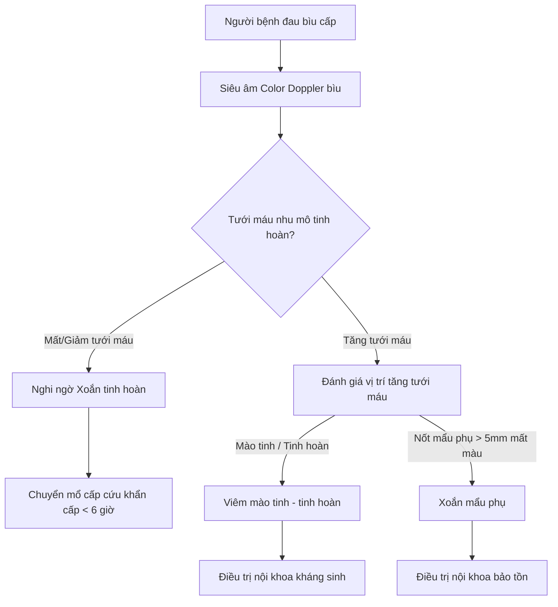

## Tổng quan

Đau tinh hoàn cấp (đau bìu cấp – _acute scrotal pain_) là cấp cứu y khoa thường gặp. Việc đánh giá siêu âm nhanh chóng và chính xác có vai trò quyết định trong việc bảo tồn chức năng tinh hoàn của người bệnh.1

### Các Nguyên nhân Thường gặp
1. **Xoắn tinh hoàn (_Testicular Torsion_):** Cấp cứu ngoại khoa khẩn cấp, đòi hỏi chẩn đoán và tháo xoắn trong vòng **6 giờ** đầu để cứu sống nhu mô tinh hoàn.
2. **Xoắn mẩu phụ mào tinh / tinh hoàn (_Torsion of Testicular Appendages_):** Nguyên nhân hàng đầu gây đau bìu cấp ở trẻ em tiền dậy thì (7–14 tuổi), điều trị nội khoa bảo tồn.
3. **Viêm mào tinh - tinh hoàn (_Epididymo-orchitis_):** Nguyên nhân hàng đầu gây đau bìu ở nam giới trưởng thành, điều trị nội khoa bằng kháng sinh và chống viêm.

:::danger[Cửa sổ Thời gian Vàng]
Xoắn tinh hoàn là cấp cứu ngoại khoa thời gian vàng. Nếu không được can thiệp tháo xoắn trong vòng **6 giờ** đầu, tỷ lệ hoại tử tinh hoàn phải cắt bỏ lên tới **80%–100%**.
:::

### Dấu hiệu Lâm sàng
- **Dấu hiệu Prehn:** Nâng nhẹ tinh hoàn tổn thương lên cao:
  - **Prehn dương tính:** Bớt đau $\rightarrow$ Gợi ý viêm mào tinh - tinh hoàn.
  - **Prehn âm tính:** Đau không giảm hoặc tăng lên $\rightarrow$ Gợi ý xoắn tinh hoàn.
- **Dấu hiệu chấm xanh (_Blue dot sign_):** Đốm màu xanh hoại tử ẩn dưới da bìu ở cực trên tinh hoàn $\rightarrow$ Gợi ý xoắn mẩu phụ.

---

## Chuẩn bị & Kỹ thuật Khảo sát

### 1. Chuẩn bị Người bệnh
- Người bệnh nằm ngửa, bộc lộ vùng bẹn bìu.
- Cố định hai tinh hoàn nhẹ nhàng bằng găng tay y tế hoặc khăn đệm bên dưới.
- Phủ khăn che đảm bảo riêng tư cho người bệnh.

### 2. Lựa chọn Đầu dò & Cài đặt Máy
- **Đầu dò:** Sử dụng đầu dò Linear tần số cao (7,5–12 MHz).
- **Cài đặt Doppler:** Điều chỉnh thang vận tốc màu (PRF) thấp xuống mức **3–5 cm/s** để phát hiện dòng máu vận tốc thấp trong nhu mô tinh hoàn.
- **Mặt cắt đối chiếu:** Bắt buộc thực hiện mặt cắt ngang đối chiếu đồng thời cả **hai tinh hoàn trên cùng một hình ảnh** (transverse comparison view) để so sánh kích thước, hồi âm và tín hiệu Doppler giữa bên bệnh và bên lành.

---

## Tiêu chuẩn Chẩn đoán Siêu âm

### 1. Viêm mào tinh - tinh hoàn
- **Viêm mào tinh cấp:** Mào tinh sưng to (đặc biệt vùng đuôi), hồi âm giảm hoặc không đều. Tăng tín hiệu tưới máu rõ rệt trên Color Doppler (_P_ < .001).
- **Viêm tinh hoàn thứ phát:** Tinh hoàn kế cận sưng to, nhu mô giảm hồi âm khu trú/lan tỏa kèm tăng tưới máu.
- **Viêm tinh hoàn do Quai bị (_Mumps Orchitis_):** Tinh hoàn sưng to, giảm hồi âm lan tỏa và tăng tưới máu dữ dội toàn bộ tinh hoàn (gặp sau viêm tuyến mang tai 3–14 ngày).

### 2. Xoắn tinh hoàn
- **Dấu hiệu B-mode:** Tinh hoàn sưng to, nằm cao, **trục tinh hoàn nằm ngang**. Tràn dịch màng tinh mạc phản ứng bao quanh.
- **Dấu hiệu Doppler:**
  - **Dấu hiệu Xoáy nước (_Whirlpool sign_):** Thừng tinh bị xoắn vặn tạo thành khối cuộn xoáy ở gốc bìu.
  - **Giảm hoặc mất tưới máu:** Giảm mạnh hoặc mất hoàn toàn tín hiệu Color Doppler trong nhu mô tinh hoàn bên tổn thương so với bên lành (Sensitivity 96%, Specificity 98%; 95% CI, 92%-99%).
  - **Biến đổi phổ:** Dòng tâm trương bị khuyết, chỉ số trở kháng (RI) tăng cao hoặc có dòng đảo ngược cuối tâm trương.

### 3. Xoắn mẩu phụ mào tinh / tinh hoàn
- Mẩu phụ sưng to hình cầu, đường kính **> 5 mm**.
- **Hình ảnh Muối tiêu (_Salt-and-pepper pattern_):** Nốt mẩu phụ hoại tử có hồi âm hỗn hợp.
- **Doppler màu:** Mẩu phụ bị xoắn **hoàn toàn không có tín hiệu mạch máu**, trong khi mào tinh và tổ chức xung quanh tăng tưới máu phản ứng.

---

## Chẩn đoán Phân biệt Đau Bìu Cấp

| Đặc điểm | Viêm mào tinh - tinh hoàn | Xoắn tinh hoàn | Xoắn mẩu phụ |
| :--- | :--- | :--- | :--- |
| **Độ tuổi thường gặp** | Người trưởng thành | Trẻ dậy thì (12–18 tuổi) | Trẻ em (7–14 tuổi) |
| **Khởi phát & Lâm sàng** | Từ từ, kèm sốt, Prehn (+) | Đột ngột, nôn ói, Prehn (-) | Đau vừa, dấu *Blue dot* (+) |
| **Vị trí tinh hoàn** | Bình thường | Nằm cao, trục nằm ngang | Bình thường |
| **Hình ảnh B-mode** | Mào tinh sưng to, giảm âm | Tinh hoàn sưng, giảm âm | Mẩu phụ sưng hình cầu > 5 mm |
| **Tưới máu Doppler** | **Tăng tưới máu mạnh** | **Giảm hoặc mất tưới máu** | Mẩu phụ mất màu, xung quanh tăng |
| **Dấu hiệu đặc hiệu** | Tăng phổ Doppler lan tỏa | Dấu Xoáy nước (*Whirlpool*) | Dấu Chấm xanh, dạng Muối tiêu |
| **Xử trí** | Điều trị nội khoa (kháng sinh) | **Mổ cấp cứu khẩn cấp (< 6 giờ)** | Điều trị nội khoa bảo tồn |

---

## Sơ đồ Hướng dẫn Xử trí Lâm sàng

---

## Tài liệu Tham khảo

1. Bandarkar AN, Blask AR. Testicular torsion with emphasis on color Doppler sonography. _J Ultrasound Med_. 2018;37(2):281-292. doi:10.1002/jum.14331
2. Dogra VS, Gottlieb RH, Oka F, et al. Sonography of the scrotum. _Radiology_. 2003;227(1):18-36. doi:10.1148/radiol.2271001744
