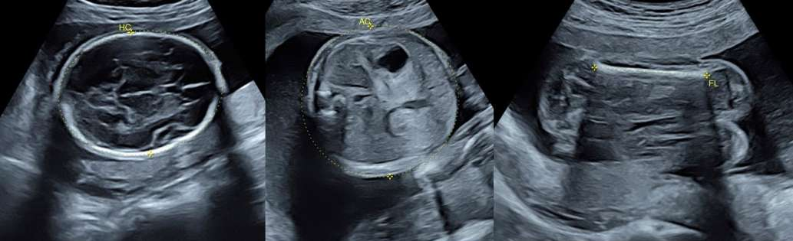
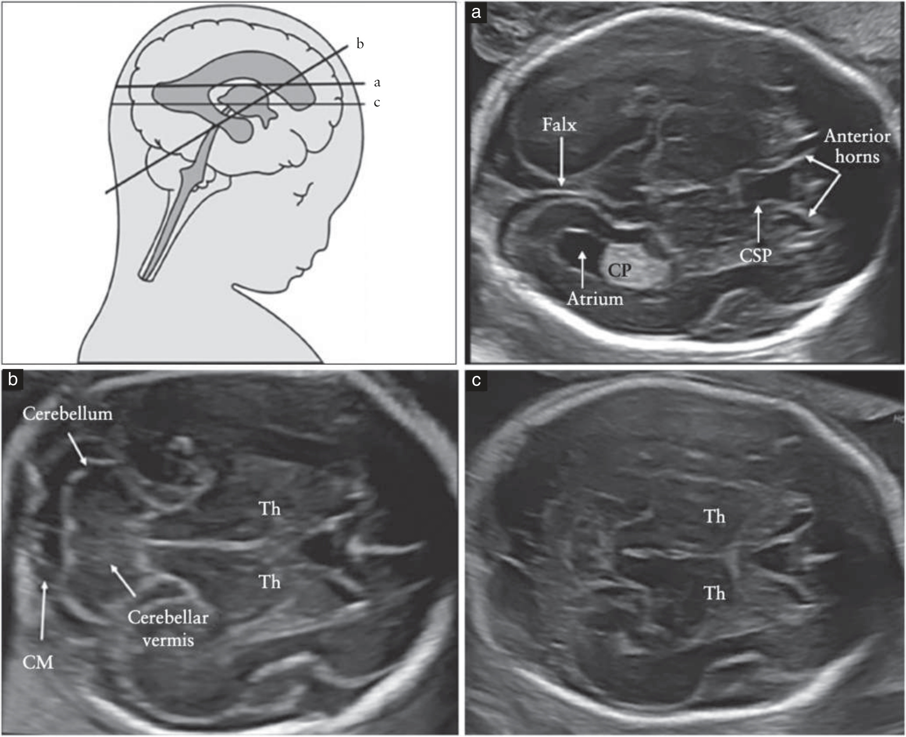
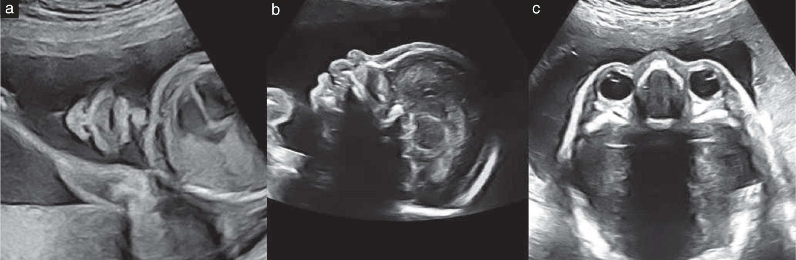
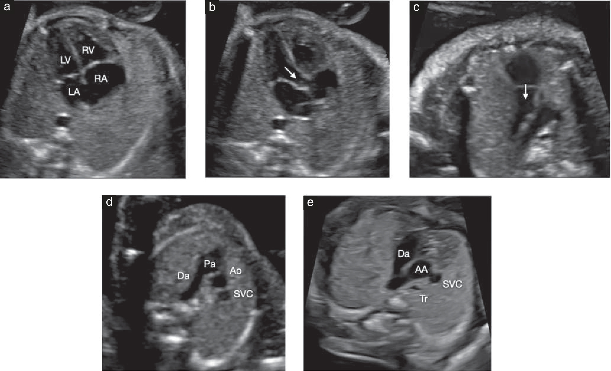
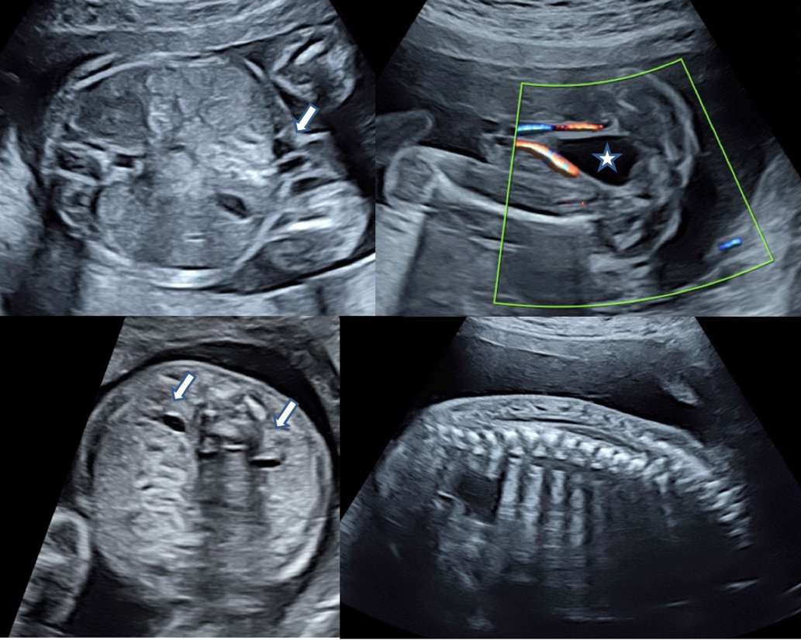
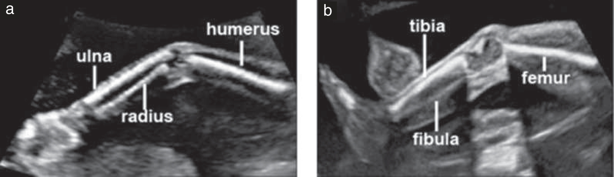
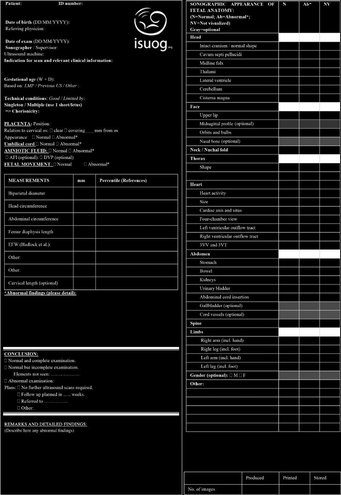

## Tổng quan & Chỉ định

Siêu âm thai quý 2 (thường gọi là **siêu âm hình thái thai nhi** hay _mid-trimester anomaly scan_) được khuyến cáo thực hiện ở tuổi thai từ **18 tuần 0 ngày đến 22 tuần 6 ngày**. Đây là cuộc kiểm tra toàn diện nhằm khảo sát chi tiết cấu trúc giải phẫu thai nhi, phát hiện các dị tật bẩm sinh hình thái và đánh giá sự phát triển thai nhi.1

### Mục tiêu Lâm sàng Cốt lõi
- **Đánh giá sinh trắc học thai nhi:** Đo BPD, HC, AC, FL để ước tính trọng lượng thai nhi (EFW) và theo dõi đà tăng trưởng.
- **Khảo sát hình thái giải phẫu toàn diện:** Khảo sát hệ thần kinh trung ương, khuôn mặt, lồng ngực - tim, ổ bụng, hệ tiết niệu, cột sống và tứ chi.
- **Đánh giá phần phụ thai kỳ:** Xác định vị trí bánh nhau, đo khoảng cách từ bờ dưới bánh nhau đến lỗ trong cổ tử cung, đo thể tích nước ối và vị trí dây rốn cắm.2

---

## Chuẩn bị & Kỹ thuật Khảo sát

### Thiết bị & Tối ưu hóa Hình ảnh
- **Đầu dò ngả bụng (Convex):** Sử dụng tần số **3,5–5,0 MHz**.
- **Tiêu điểm (Focus):** Đặt một tiêu điểm tại độ sâu của cấu trúc khảo sát.
- **Đầu dò ngả âm đạo (TVS):** Chỉ định khi nghi ngờ bánh nhau tiền đạo, cổ tử cung ngắn hoặc khi hình ảnh qua đường bụng bị hạn chế (mẹ có BMI cao, sẹo mổ cũ).

---

## Sinh trắc học & Giải phẫu Thai nhi

### 1. Sinh trắc học Thai nhi
- **Đường kính Lưỡng đỉnh (BPD) & Chu vi Đầu (HC):** Đo ở mặt cắt qua đồi thị (_transthalamic view_), thấy vách trong suốt (CSP) và 2 đồi thị. Đo BPD từ bờ ngoài xương sọ gần đến bờ trong xương sọ xa (_outer-to-inner_).
- **Chu vi Bụng (AC):** Mặt cắt ngang bụng chuẩn hình tròn, thấy đoạn tĩnh mạch rốn nối tĩnh mạch cửa trái hình chữ T hoặc J, bóng dạ dày bên trái.
- **Chiều dài Xương đùi (FL):** Đo toàn bộ trục dọc thân xương hóa cốt (_diaphysis_), chùm âm vuông góc với thân xương.

| Mặt cắt sọ nổi bật | Cấu trúc giải phẫu quan sát | Chỉ số & Giá trị bình thường |
| :--- | :--- | :--- |
| **Mặt cắt Não thất (Transventricular)** | Sừng sau brain thất bên, đám rối màng mạch, CSP | Đường kính sừng sau brain thất bên **< 10 mm** |
| **Mặt cắt Đồi thị (Transthalamic)** | Đồi thị, vách trong suốt (CSP), dải thị | Sinh trắc BPD và HC |
| **Mặt cắt Tiểu脳 (Transcerebellar)** | 2 bán cầu tiểu não, thùy nhộng, bể lớn, nếp da gáy | Bể lớn **2–10 mm**, nếp da gáy **< 6 mm** (trước 20 tuần) |

### 2. Khảo sát Hình thái Giải phẫu

- **Khuôn mặt:** Mặt cắt vành quan sát môi trên liên tục và 2 lỗ mũi (loại trừ sứt môi), quan sát 2 nhãn cầu cân đối.

- **Tim & Lồng ngực:** Khảo sát 5 mặt cắt tim tiêu chuẩn theo ISUOG (mặt cắt 4 buồng, đường ra thất trái LVOT, đường ra thất phải RVOT, mặt cắt 3 mạch máu và khí quản 3VT). Trục tim quay trái **45° ± 20°**.

- **Ổ bụng & Tiết niệu:** Dạ dày chứa dịch bên trái, dây rốn cắm vào thành bụng nguyên vẹn, 2 thận không bị giãn (đường kính trước-sau bể thận APD **< 7 mm**).

- **Cột sống & Tứ chi:** Cột sống liên tục với lớp da phủ nguyên vẹn, khảo sát đủ 4 chi với 3 đoạn xương dài mỗi chi.

- **Bánh nhau & Nước ối:** Bánh nhau bám cách lỗ trong cổ tử cung **≥ 20 mm**. Đo xoang ối lớn nhất (DVP) bình thường trong khoảng **2–8 cm**.

---

## Tiêu chuẩn Chẩn đoán & Bệnh lý

### 1. Bất thường Hệ thần kinh Trung ương
- **Giãn brain thất bên (_Ventriculomegaly_):** Sừng sau brain thất bên **10–12 mm** (giãn nhẹ), **13–15 mm** (giãn trung bình), **> 15 mm** (giãn nặng).
- **Tật nứt đốt sống (_Spina bifida_):** Mất liên tục vòm sau đốt sống kèm dấu hiệu "quả chanh" (móp xương trán) và "quả chuối" (tiểu não gập cong).

### 2. Dấu hiệu Siêu âm Lệch bội (Soft Markers quý 2)
- Nếp da gáy dày (**≥ 6 mm** trước 20 tuần).
- Xương đùi / xương cánh tay ngắn (**< bách phân vị 5**).
- Nốt hồi âm dày trong thất tim (EIF).
- Ruột tăng hồi âm (sáng bằng hoặc hơn xương thai nhi).
- Giãn bể thận nhẹ (APD **4–7 mm**).

---

## Tài liệu Tham khảo

1. Salomon LJ, Alfirevic Z, Berghella V, et al. ISUOG Practice Guidelines (updated): performance of the routine mid-trimester fetal ultrasound scan. _Ultrasound Obstet Gynecol_. 2022;59(6):840-856. doi:10.1002/uog.24888
2. ISUOG Clinical Standards Committee. Practice guidelines for performance of the routine mid-trimester fetal ultrasound scan. _Ultrasound Obstet Gynecol_. 2011;37(1):116-126. doi:10.1002/uog.8831
