## Tổng quan và Chỉ định

Siêu âm thai quý 3 được thực hiện trong khoảng tuổi thai từ **28 + 0 đến 40 + 0 tuần** (thường tập trung ở mốc **32 - 36 tuần**). Mục đích chính của cuộc siêu âm này không chỉ là đánh giá sự phát triển hình thái muộn mà còn là công cụ cốt lõi giúp chẩn đoán thai chậm phát triển trong tử cung (_Fetal Growth Restriction_ - FGR), đánh giá thể tích nước ối, vị trí bánh nhau, ngôi thai và khảo sát sức khỏe thai nhi thông qua Doppler mạch máu.

:::note Mục tiêu chính của siêu âm thai quý 3

- **Xác định sự sống, số lượng và ngôi thai** (ngôi đầu, ngôi mông, ngôi ngang).
- **Đánh giá sự phát triển sinh trắc học và trọng lượng thai**: Khảo sát BPD, HC, AC, FL và tính trọng lượng thai ước tính (EFW), phát hiện thai nhỏ so với tuổi thai (SGA), FGR hoặc thai to (Macrosomia).
- **Khảo sát cấu trúc giải phẫu muộn**: Phát hiện các bất thường xuất hiện muộn ở hệ thần kinh, hệ tiêu hóa, hệ tiết niệu và tim mạch.
- **Đánh giá thể tích nước ối**: Phát hiện thiểu ối (_oligohydramnios_) hoặc đa ối (_polyhydramnios_).
- **Đánh giá bánh nhau và dây rốn**: Định vị vị trí bánh nhau, khoảng cách đến lỗ trong cổ tử cung, phát hiện phổ bánh nhau cài răng lược (PAS) và mạch máu tiền đạo (_vasa previa_).
- **Đánh giá Doppler mạch máu thai nhi và tử cung**: Đo chỉ số trở kháng Doppler động mạch rốn, động mạch não giữa, tỷ lệ não-rốn (CPR), ống thông tĩnh mạch và động mạch tử cung.
  :::

## Kỹ thuật và Chuẩn bị

### Thiết bị và Thao tác

- **Đầu dò ngả bụng (Convex):** Tần số **3.5 - 5.0 MHz**.
- **Đầu dò ngả âm đạo (TVS):** Rất quan trọng khi đầu thai nằm lọt thấp che khuất đoạn dưới tử cung, hỗ trợ đánh giá chính xác vị trí bờ dưới bánh nhau, mạch máu tiền đạo và chiều dài cổ tử cung.
- **Tư thế người bệnh:** Nằm ngửa hoặc nghiêng nhẹ sang trái để tránh hội chứng chèn ép tĩnh mạch chủ dưới do tử cung lớn.

## Giải phẫu siêu âm bình thường và Sinh trắc học

### Sinh trắc học Thai nhi quý 3

_Hình "Thực hiện đo chu vi đầu (HC) thai nhi quý 3"._

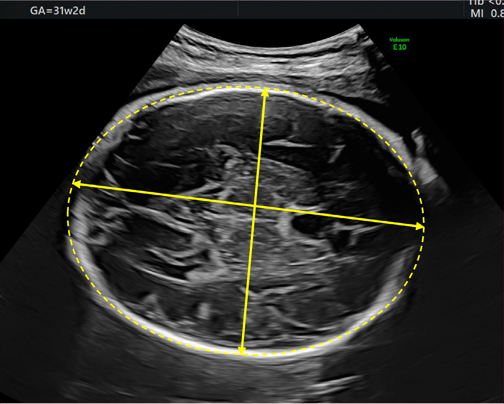

_Hình "Thực hiện đo chu vi bụng (AC) thai nhi quý 3"._

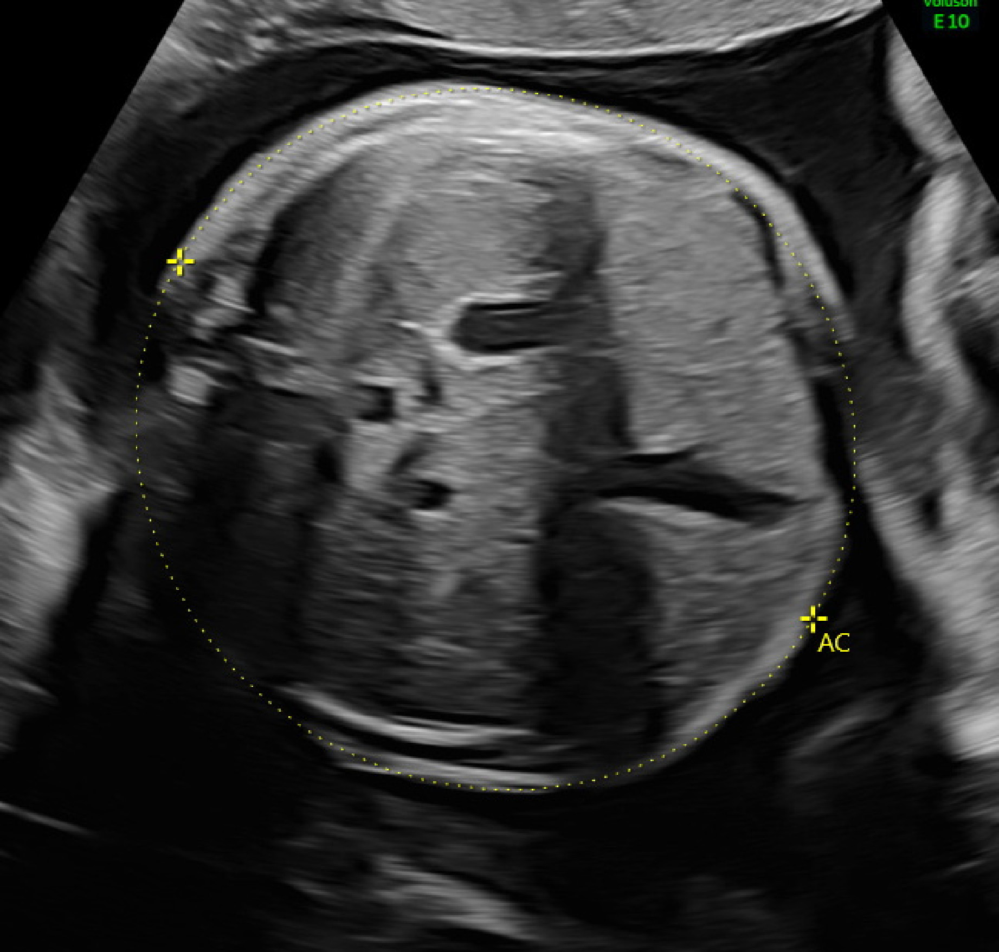

_Hình "Thực hiện đo chiều dài xương đùi (FL) thai nhi quý 3"._

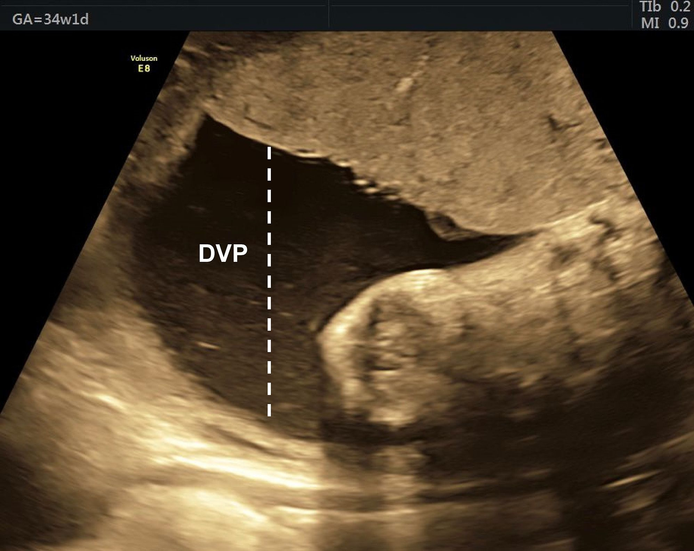

- **Đường kính lưỡng đỉnh (BPD) & Chu vi đầu (HC):** Đo ở mặt cắt ngang đồi thị. Lưu ý ở quý 3, xương sọ thai nhi bị đè ép có thể làm thay đổi chỉ số BPD, do đó HC là chỉ số đáng tin cậy hơn.
- **Chu vi bụng (AC):** Đo ở mặt cắt ngang bụng tròn chuẩn. AC là chỉ số nhạy nhất đối với sự thay đổi dinh dưỡng thai nhi và là thành phần quan trọng nhất trong công thức ước tính trọng lượng thai Hadlock.
- **Chiều dài xương đùi (FL):** Đo chiều dài phần xương hóa cốt của xương đùi.

### Khảo sát Cấu trúc Giải phẫu Muộn

#### 1. Hệ thần kinh trung ương và Tim mạch

_Hình "Khảo sát cấu trúc não thai nhi quý 3 và dấu hiệu giãn não thất"._

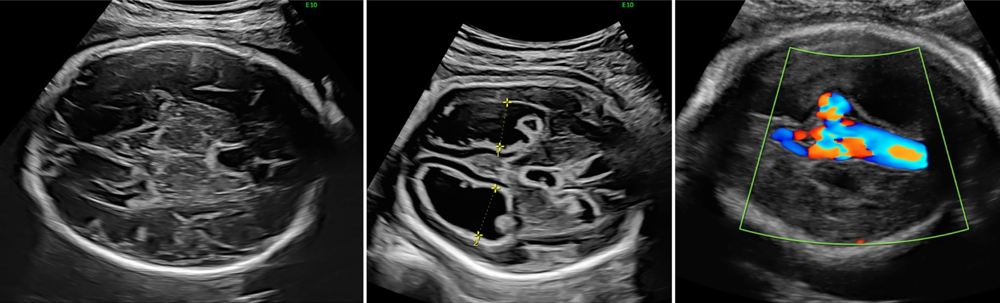

_Hình "Các mặt cắt tim thai nhi tiêu chuẩn ở quý 3"._

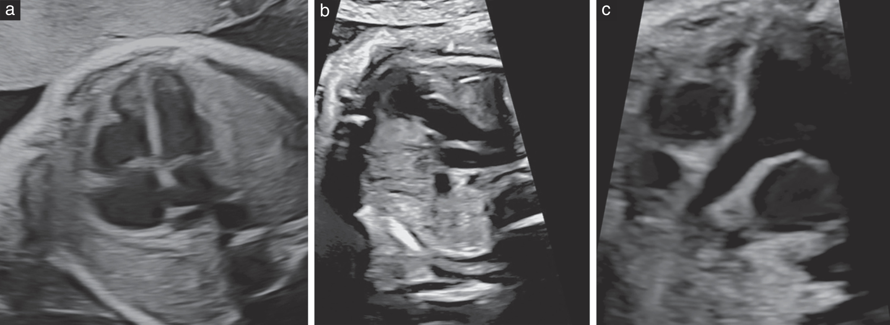

_Hình "Đánh giá các đại động mạch và bất thường hẹp eo động mạch chủ"._

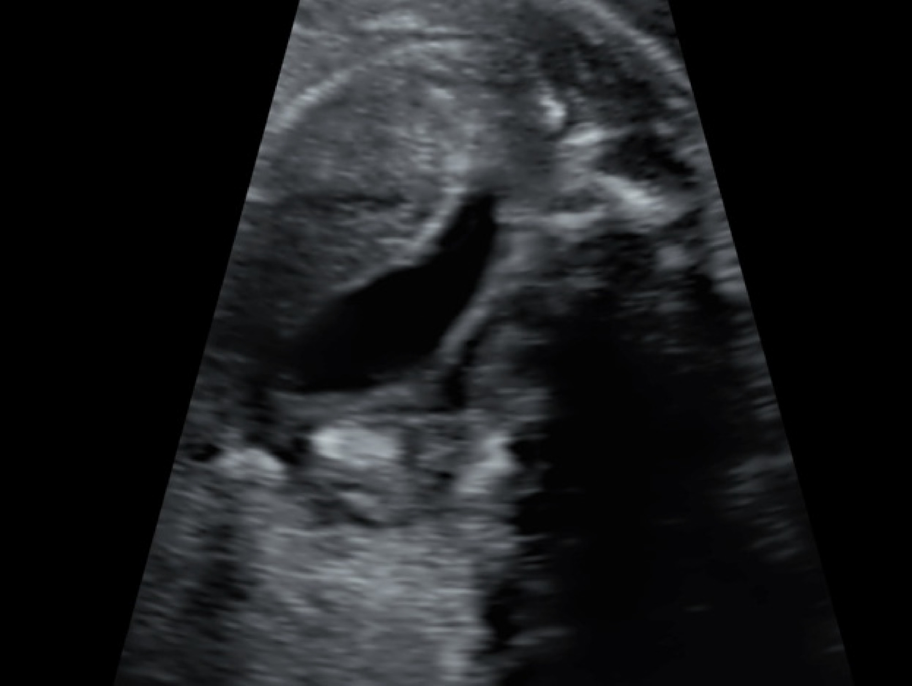

- **Cấu trúc não:** Đánh giá độ rộng sừng sau não thất bên (**< 10 mm**), sự phát triển của nếp nhăn vỏ não và vách trong suốt.
- **Tim mạch:** Khảo sát lại mặt cắt 4 buồng tim, đường ra thất trái, thất phải và 3VT. Đánh giá sự cân đối giữa các thất và các đại động mạch (phát hiện hẹp eo động mạch chủ tiến triển).

#### 2. Lồng ngực, Bụng và Hệ tiết niệu

_Hình "Khảo sát liên tục của cơ hoành hai bên trên mặt cắt dọc"._

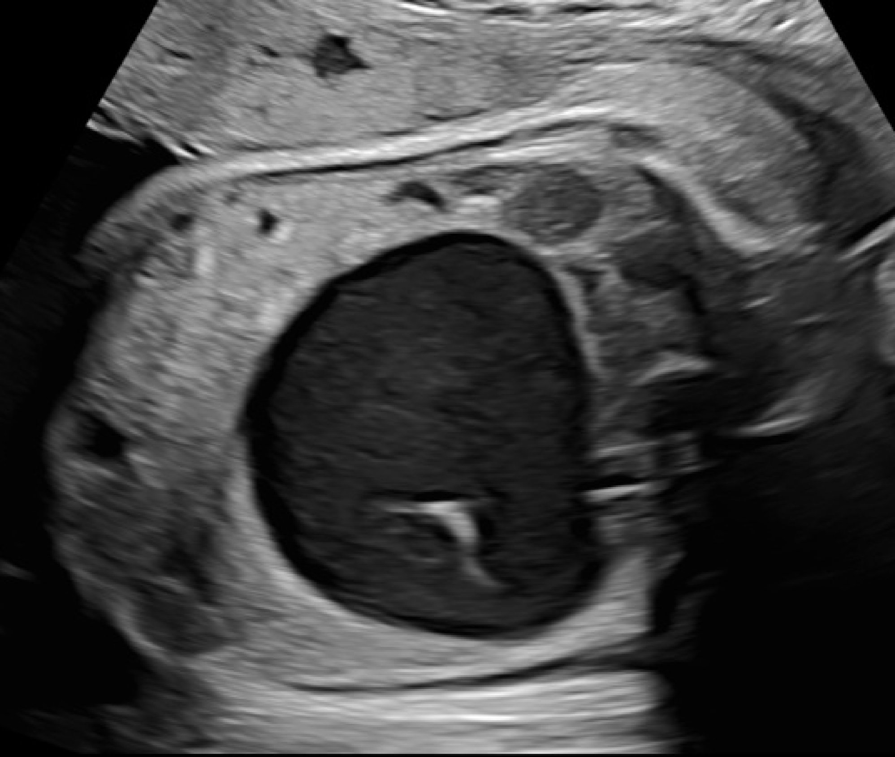

_Hình "Khảo sát nang buồng trứng thai nhi ở quý 3"._

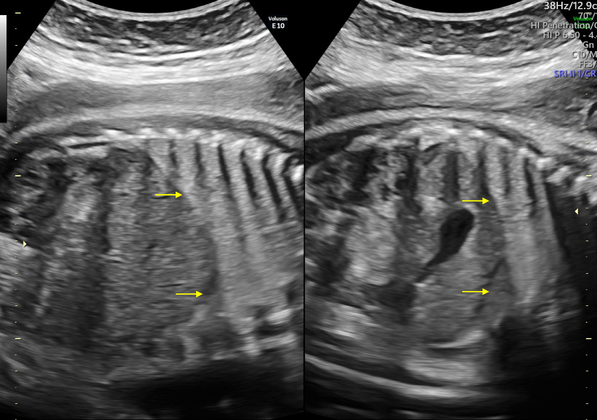

_Hình "Khảo sát hình thái thận thai nhi quý 3"._

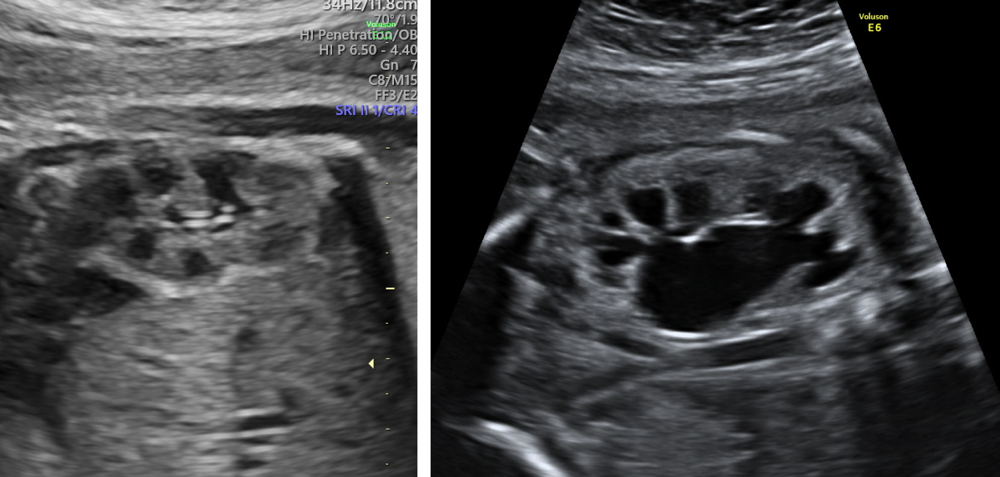

- **Cơ hoành:** Khảo sát vòm cơ hoành liên tục ngăn cách lồng ngực và ổ bụng.
- **Tạng bụng & Sinh dục:** Khảo sát dạ dày, ruột (phát hiện giãn ruột, hẹp tá tràng muộn), bàng quang và nang buồng trứng thai nhi.
- **Thận:** Đánh giá nhu mô thận và đường kính trước-sau bể thận APD. Ở quý 3, APD **≥ 7 mm** được coi là giãn bể thận.

### Đánh giá Thể tích Nước ối

_Hình "Đo chỉ số xoang ối lớn nhất (DVP) trong đánh giá thể tích nước ối"._

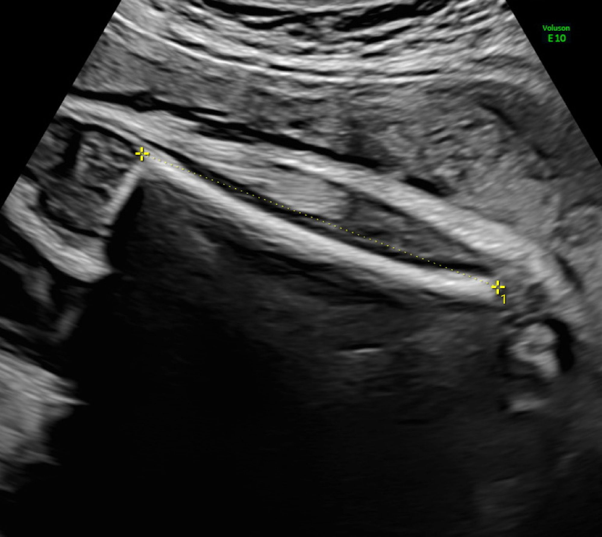

_Hình "Đánh giá trường hợp đa ối ở quý 3 (AFI > 25 cm hoặc DVP > 8 cm)"._

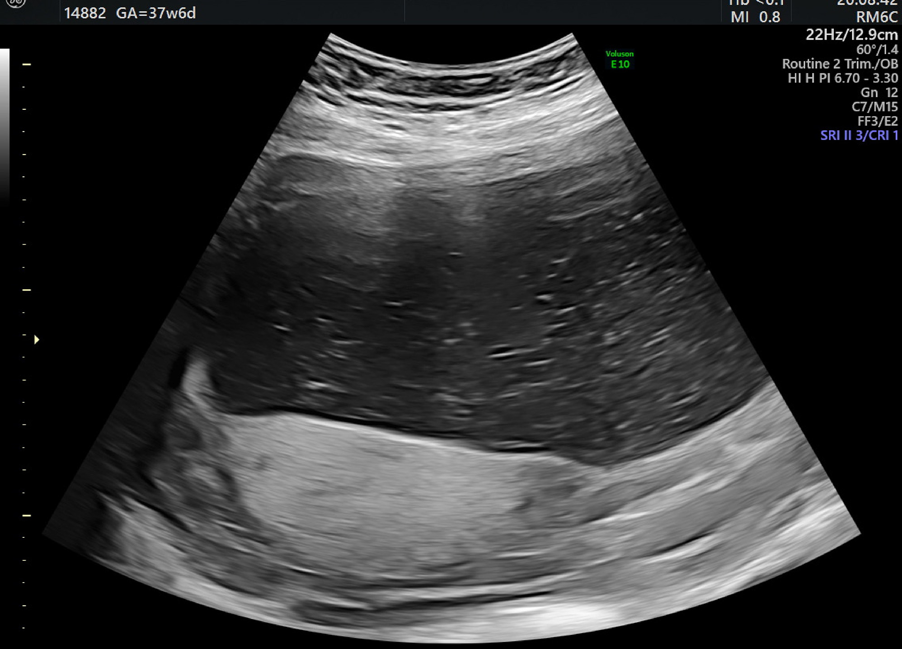

_Hình "Mức độ hồi âm nhẹ đồng nhất của nước ối do chất gây thai nhi ở cuối thai kỳ"._

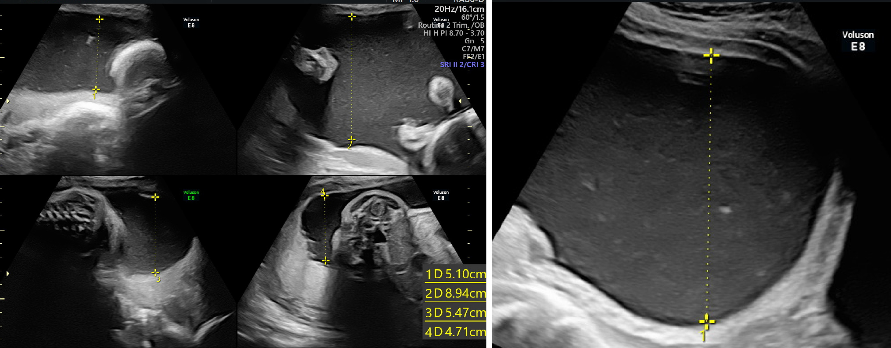

- **Xoang ối lớn nhất (DVP):** Đo khoảng cách thẳng đứng lớn nhất của túi nước ối không chứa chi hay dây rốn.
  - **Bình thường:** **2.0 - 8.0 cm**.
  - **Thiểu ối (Oligohydramnios):** DVP **< 2.0 cm**.
  - **Đa ối (Polyhydramnios):** DVP **> 8.0 cm**.
- **Chỉ số nước ối (AFI):** Tổng chiều sâu DVP của 4 góc phần tư tử cung. AFI **≤ 5.0 cm** định nghĩa thiểu ối, AFI **> 25.0 cm** định nghĩa đa ối.

### Khảo sát Bánh nhau và Mạch máu Dây rốn

_Hình "Chẩn đoán bánh nhau bám thấp / nhau tiền đạo khi khoảng cách bờ dưới bánh nhau đến lỗ trong cổ tử cung < 20 mm"._

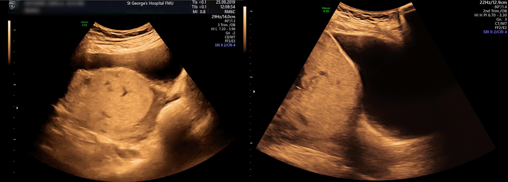

_Hình "Dấu hiệu siêu âm bất thường trong phổ bánh nhau cài răng lược (PAS)"._

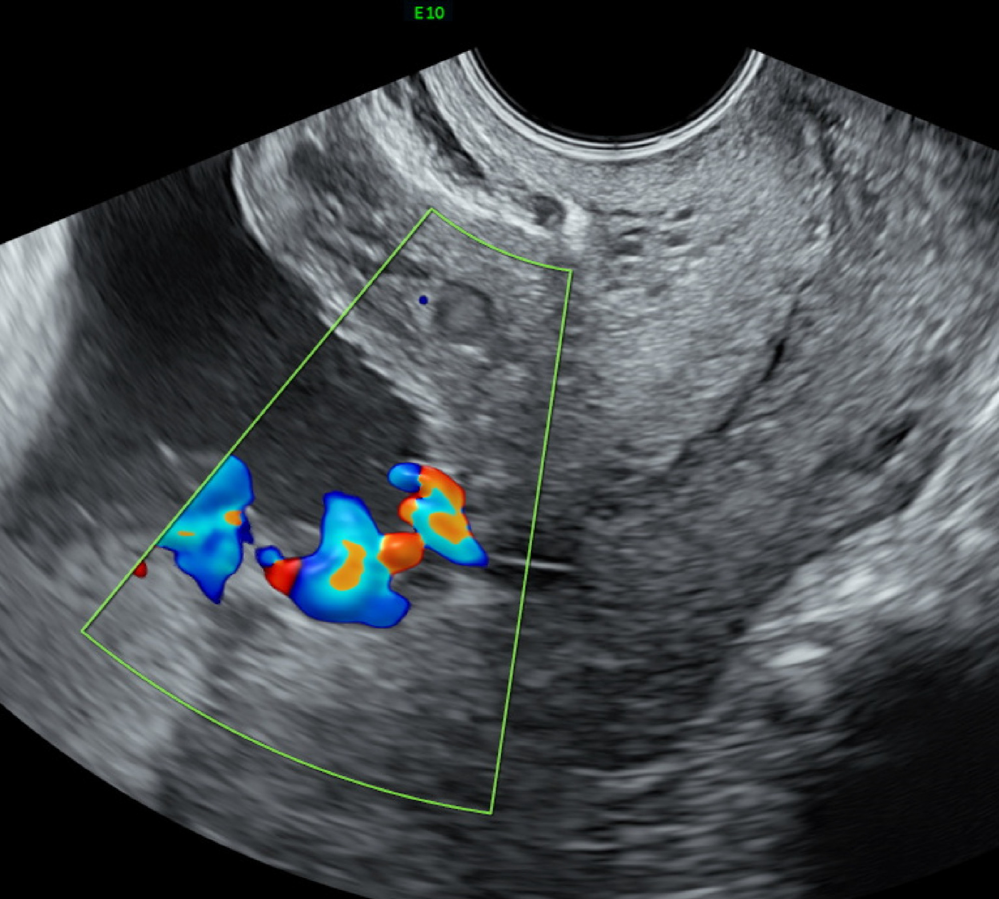

_Hình "Chẩn đoán mạch máu tiền đạo (Vasa previa) bằng siêu âm Doppler màu"._

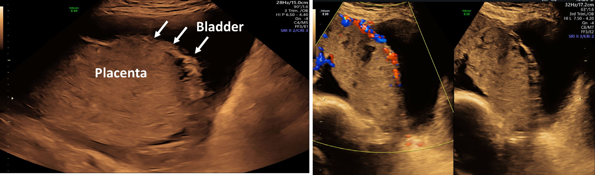

:::danger Các bệnh lý bánh nhau nguy hiểm cần phát hiện ở quý 3

- **Bánh nhau tiền đạo (Placenta Previa):** Bánh nhau che lấp lỗ trong cổ tử cung. Nếu bờ dưới bánh nhau cách lỗ trong **< 20 mm**, cần theo dõi sát và lên kế hoạch mổ lấy thai.
- **Phổ bánh nhau cài răng lược (PAS):** Bánh nhau xâm lấn vào cơ tử cung hoặc bàng quang, xuất hiện các hốc nhau (lacunae) bất thường, mất vùng kém hồi âm sau nhau và tăng sinh mạch máu uterovesical.
- **Mạch máu tiền đạo (Vasa Previa):** Mạch máu thai nhi không được bảo vệ chạy màng qua lỗ trong cổ tử cung, nguy cơ vỡ mạch máu gây tử vong thai nhi cực kỳ nhanh chóng khi chuyển dạ.
  :::

## Khảo sát Doppler Mạch máu Thai nhi và Tử cung

_Hình "Phổ sóng Doppler động mạch rốn bình thường ở quý 3"._

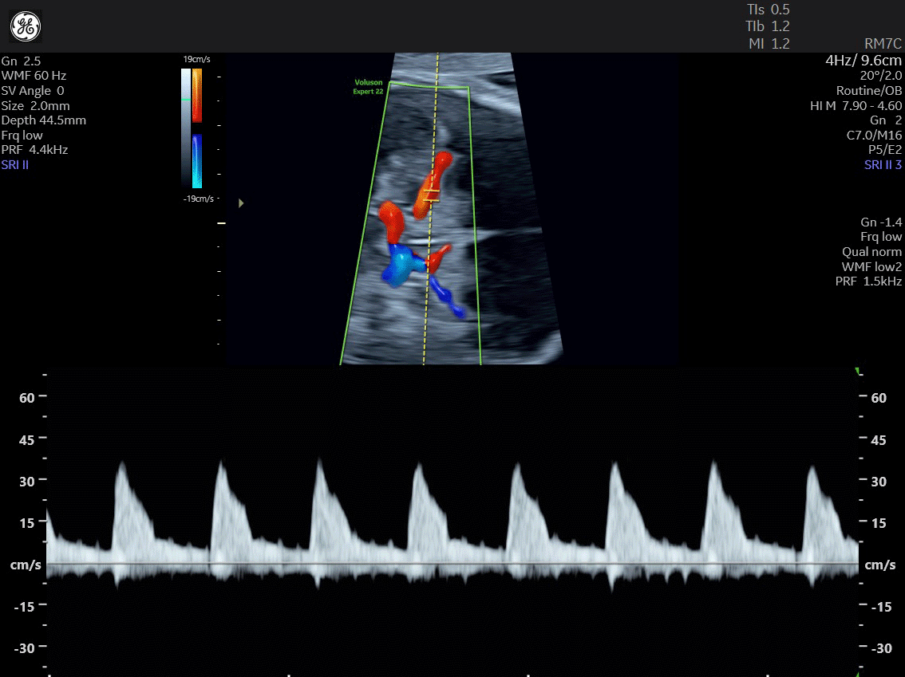

_Hình "Phổ sóng Doppler động mạch não giữa (MCA) ở quý 3"._

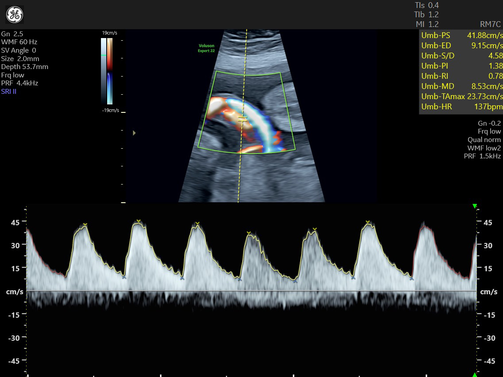

_Hình "Phổ sóng Doppler ống thông tĩnh mạch (Ductus Venosus) ở quý 3"._

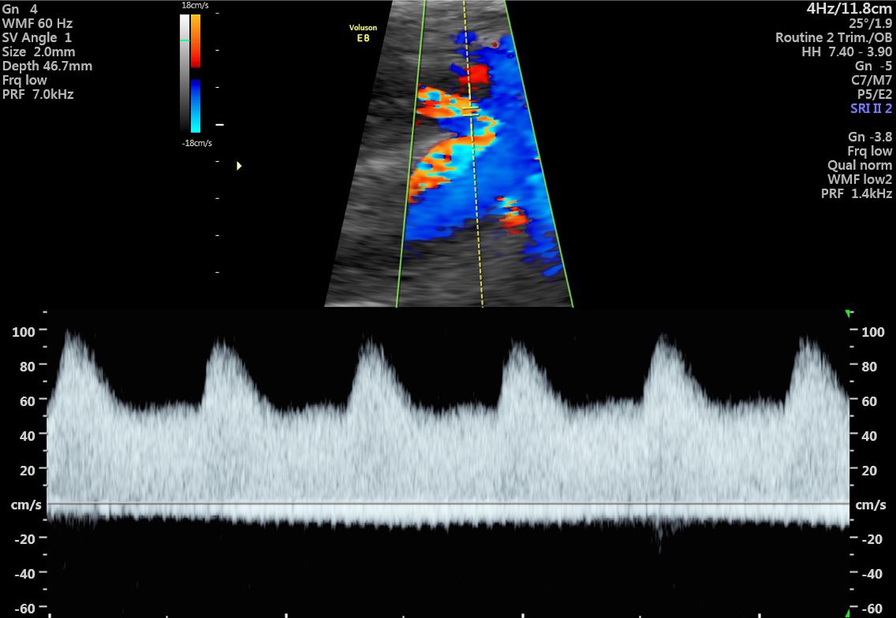

_Hình "Phổ sóng Doppler động mạch tử cung mẹ ở quý 3"._

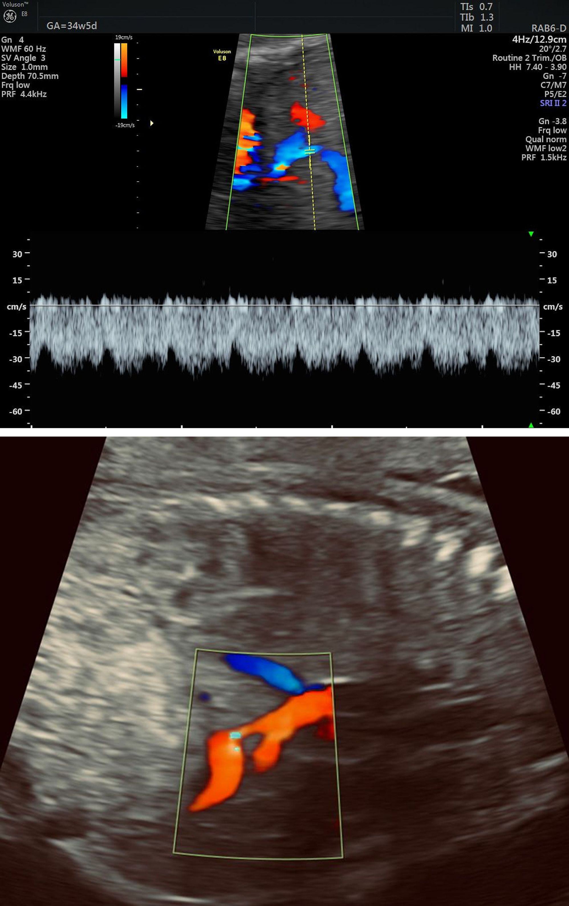

_Bảng "Ý nghĩa lâm sàng của các chỉ số Doppler mạch máu trong quý 3"._

| Mạch máu khảo sát                   | Chỉ số Doppler quan trọng               | Dấu hiệu bất thường & Ý nghĩa lâm sàng                                                                                               |
| :---------------------------------- | :-------------------------------------- | :----------------------------------------------------------------------------------------------------------------------------------- |
| **Động mạch rốn (UA)**              | Chỉ số trở kháng (UA-PI)                | UA-PI **> bách phân vị 95**, mất dòng cuối tâm trương (AEDED) hoặc đảo ngược (REDED) chỉ điểm suy nhau nặng                          |
| **Động mạch não giữa (MCA)**        | MCA-PI & Vận tốc đỉnh tâm thu (MCA-PSV) | MCA-PI giảm (**< bách phân vị 5**) phản ánh hiệu ứng bảo vệ não (_brain-sparing_). MCA-PSV **> 1.5 MoM** chỉ điểm thiếu máu thai nhi |
| **Tỷ lệ Trở kháng Não - Rốn (CPR)** | CPR = MCA-PI / UA-PI                    | CPR **< 1.0** hoặc **< bách phân vị 5** nhận diện thai FGR có nguy cơ suy thai và ngạt muộn                                          |
| **Ống thông tĩnh mạch (DV)**        | Chỉ số trở kháng (DV-PI) & Sóng a       | Sóng a âm hoặc đảo ngược phản ánh suy tim thai nhi nghiêm trọng, nguy cơ tử vong thai nhi cao                                        |
| **Động mạch tử cung (UtA)**         | Chỉ số trở kháng trung bình (UtA-PI)    | UtA-PI **> bách phân vị 95** liên quan đến nguy cơ tiền giật muộn và suy tuần hoàn tử cung-nhau                                      |

## Xảo ảnh và Hạn chế

- **Bóng lưng từ xương thai nhi:** Khối lượng xương thai nhi quý 3 hóa cốt mạnh gây bóng lưng cứng, che khuất các cấu trúc nằm sâu.
- **Giảm thể tích nước ối:** Khi nước ối ít, thai nhi bị chèn ép khiến các mặt cắt hình thái bị hạn chế rõ rệt.
- **Đầu thai lọt thấp:** Đầu thai nhi nằm sâu trong tiểu khung mẹ khiến không thể đo BPD/HC bằng ngả bụng; cần kết hợp siêu âm ngả âm đạo.

## Tài liệu tham khảo

- Khalil A, Sotiriadis A, D'Antonio F, Da Silva Costa F, Odibo A, Prefumo F, Papageorghiou AT, ISUOG Guidelines Committee (2024) - _ISUOG Practice Guidelines: performance of third-trimester obstetric ultrasound scan_. Ultrasound in Obstetrics & Gynecology, 63(1), 131-147. [https://doi.org/10.1002/uog.27538](https://doi.org/10.1002/uog.27538)
- Salomon LJ, Alfirevic Z, Da Silva Costa F, Deter RL, Figueras F, Ghi T, Glanc P, Khalil A, Lee W, Napolitano R, Papageorghiou A, Sotiriadis A, Stirnemann J, Toi A, Yeo G (2019) - _ISUOG Practice Guidelines: ultrasound assessment of fetal biometry and growth_. Ultrasound in Obstetrics & Gynecology, 53(6), 715-723.
- Ministry of Health Vietnam (2020) - _Hướng dẫn quy trình kỹ thuật chuyên ngành Sản Phụ khoa_.
