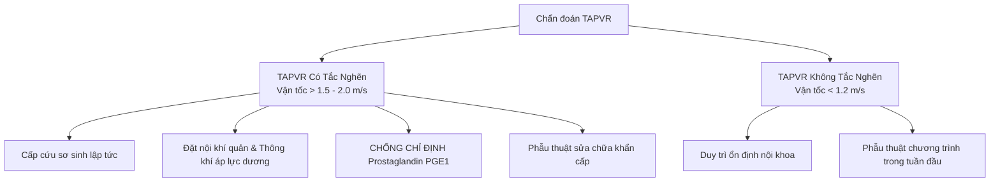

## Tổng quan

Bất thường hồi lưu tĩnh mạch phổi (_Anomalous Pulmonary Venous Return_ – APVR / _Anomalous Pulmonary Venous Connection_ – TAPVC) là nhóm dị tật tim bẩm sinh hiếm gặp nhưng đặc biệt nguy hiểm, chiếm khoảng **0,7%–1,5%** các dị tật tim bẩm sinh với tần suất xuất hiện **7–9 / 100.000** trẻ sinh sống. Đây là dị tật tim bẩm sinh gây tím duy nhất do nguyên nhân bất thường của hệ thống tĩnh mạch. Việc chẩn đoán sớm trên siêu âm tim thai và siêu âm tim sơ sinh đóng vai trò quyết định đối với tiên lượng sống còn của trẻ.1

### Định nghĩa & Phôi thai học

- **Bất thường hồi lưu tĩnh mạch phổi toàn phần (TAPVR/TAPVC):** Tất cả **4 tĩnh mạch phổi** không đổ về nhĩ trái, mà kết nối qua xoang chung (_common pulmonary vein_) và tĩnh mạch dọc (_vertical vein_) để dẫn máu về nhĩ phải hoặc tĩnh mạch hệ thống.
- **Bất thường hồi lưu tĩnh mạch phổi một phần (PAPVR/PAPVC):** Có từ **1 đến 3 tĩnh mạch phổi** kết nối bất thường vào tĩnh mạch hệ thống hoặc nhĩ phải.
- **Phôi thai học:** Do sự thất bại trong việc hình thành chồi tĩnh mạch phổi chung từ thành sau nhĩ trái nối với đám rối tĩnh mạch tạng (splanchnic plexus) ở tuần thứ 4–5 phôi thai.
- **Điều kiện duy trì sự sống:** Trong TAPVR, lỗ bầu dục (_foramen ovale_ – FO) hoặc thông liên nhĩ (ASD) là **điều kiện bắt buộc duy nhất** để máu từ nhĩ phải sang nhĩ trái và thất trái nuôi cơ thể.2

---

## Phân loại Bệnh lý (Phân loại Darling)

| Thể bệnh (Darling)          | Tỷ lệ chung | Vị trí nhận máu bất thường & Đường đi                                                                              |
| :-------------------------- | :---------- | :----------------------------------------------------------------------------------------------------------------- |
| **Thể trên tim (Type I)**   | **45%–55%** | Tĩnh mạch chủ trên (SVC) hoặc tĩnh mạch vô danh (_innominate vein_). Xoang chung dẫn máu qua tĩnh mạch dọc đi lên. |
| **Thể tại tim (Type II)**   | **20%–30%** | Xoang vành (_coronary sinus_) hoặc đổ trực tiếp vào nhĩ phải, làm xoang vành giãn to bất thường.                   |
| **Thể dưới tim (Type III)** | **13%–25%** | Tĩnh mạch chủ dưới (IVC), tĩnh mạch cửa hoặc tĩnh mạch gan. **Có tỷ lệ tắc nghẽn cao nhất (> 90%)**.               |
| **Thể hỗn hợp (Type IV)**   | **< 10%**   | Phối hợp từ 2 vị trí đổ bất thường trở lên.                                                                        |

---

## Kỹ thuật Khảo sát Siêu âm

### 1. Khảo sát Siêu âm Tim thai (Theo ISUOG)

- **Mặt cắt 4 buồng tim (4CV):**

- Cài đặt Doppler màu với PRF thấp (**15–30 cm/s**). Không thấy tín hiệu đủ 4 tĩnh mạch phổi cắm vào thành sau nhĩ trái.
- Thành sau nhĩ trái phẳng trơn. Khoảng cách giữa thành sau nhĩ trái và động mạch chủ xuống tăng (**Post-LA Space Index > 1,27**).

- Phổ Doppler xung tĩnh mạch phổi bình thường có dạng 3 pha (S, D, A) với vận tốc **< 40 cm/s**.

- Trong TAPVR có tắc nghẽn, phổ Doppler tại tĩnh mạch dọc chuyển thành dải liên tục đơn pha với vận tốc cao **> 50 cm/s** đến **> 1,5–2,0 m/s** (Sensitivity 92%, Specificity 96%; 95% CI, 88%-98%).

- **Mặt cắt 3 mạch máu - khí quản (3VT):**
  - Trong thể trên tim, quan sát thấy mạch máu thứ 4 (tĩnh mạch dọc lên) nằm cạnh SVC, SVC bị phì đại.

---

## Cạm bẫy Chẩn đoán & Chẩn đoán Phân biệt

:::caution[Chẩn đoán Phân biệt]

- **Tồn tại tĩnh mạch chủ trên trái (PLSVC) đổ xoang vành:** Cần phân biệt với TAPVR thể tại tim. Trong PLSVC, các tĩnh mạch phổi vẫn cắm bình thường vào nhĩ trái.
- **Tim ba nhĩ trái (_Cor triatriatum_):** Màng ngăn chia nhĩ trái thành 2 buồng, nhưng các tĩnh mạch phổi vẫn đổ về buồng sau nhĩ trái.
- **Cạm bẫy siêu âm:** Cài đặt PRF màu quá cao dẫn đến mất tín hiệu dòng tĩnh mạch phổi giả tạo. Cần giảm PRF xuống **15–30 cm/s**.
  :::

:::danger[Nguy cơ Thể Dưới tim]
Đối với TAPVR thể dưới tim (Type III), tắc nghẽn đường về tĩnh mạch gần như xuất hiện ngay sau sinh do sự co thắt ống tĩnh mạch và kẹp dây rốn. Trẻ xuất hiện tím tái dữ dội, phù phổi cấp tiến triển khẩn cấp tại phòng sinh!
:::

---

## Hướng Xử trí Lâm sàng

- **TAPVR có tắc nghẽn:** Phẫu thuật sửa chữa khẩn cấp. **Chống chỉ định dùng Prostaglandin E1 (PGE1)** vì làm tăng lưu lượng máu lên phổi gây phù phổi cấp nặng hơn.
- **TAPVR không tắc nghẽn:** Ổn định nội khoa và phẫu thuật chương trình trong tuần đầu sau sinh.

---

## Tài liệu Tham khảo

1. Kao CC, Hsieh CC, Cheng PJ, et al. Total anomalous pulmonary venous connection: from embryology to a prenatal ultrasound diagnostic update. _J Med Ultrasound_. 2017;25(3):130-137. doi:10.1016/j.jmu.2017.08.002
2. ISUOG Practice Guidelines (updated): sonographic screening examination of the fetal heart. _Ultrasound Obstet Gynecol_. 2023;61(6):788-803. doi:10.1002/uog.26222
