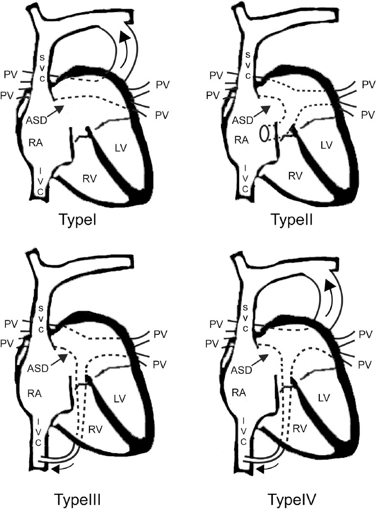
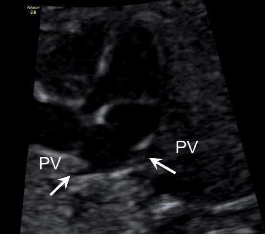
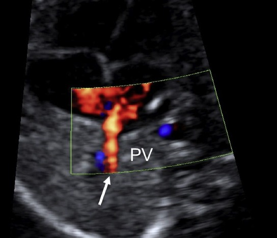
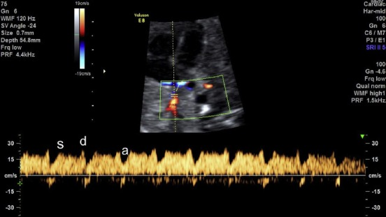
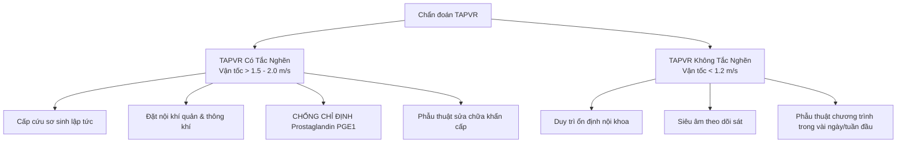

Bất thường hồi lưu tĩnh mạch phổi (_Anomalous Pulmonary Venous Return_ - APVR / _Anomalous Pulmonary Venous Connection_ - TAPVC) là nhóm dị tật tim bẩm sinh hiếm gặp nhưng đặc biệt nguy hiểm, chiếm khoảng **0.7% - 1.5%** các dị tật tim bẩm sinh với tần suất xuất hiện **7 - 9 / 100.000** trẻ sinh sống (**0.11 / 1.000** trẻ sinh sống). Đây là dị tật tim bẩm sinh gây tím duy nhất có nguyên nhân từ bất thường của hệ thống tĩnh mạch. Việc chẩn đoán sớm trên siêu âm tim thai và siêu âm tim sơ sinh đóng vai trò quyết định đối với tiên lượng sống còn của trẻ.

## Tổng quan & Phôi thai học

### Định nghĩa và Mầm thai học

Bất thường hồi lưu tĩnh mạch phổi xảy ra khi các tĩnh mạch phổi không kết nối trực tiếp vào nhĩ trái như bình thường, mà dẫn máu giàu oxy về nhĩ phải hoặc các tĩnh mạch hệ thống qua các đường nối bất thường.

- **Bất thường hồi lưu tĩnh mạch phổi toàn phần** (_Total Anomalous Pulmonary Venous Return_ - TAPVR / TAPVC): Tất cả **4 tĩnh mạch phổi** đều không nối vào nhĩ trái. Máu từ phổi đổ về xoang chung (_common pulmonary vein_) rồi qua tĩnh mạch kết nối (_connecting vein / vertical vein_) để đổ vào nhĩ phải hoặc tĩnh mạch hệ thống.
- **Bất thường hồi lưu tĩnh mạch phổi một phần** (_Partial Anomalous Pulmonary Venous Return_ - PAPVR / PAPVC): Chỉ có **1 đến 3 tĩnh mạch phổi** kết nối bất thường vào tĩnh mạch hệ thống hoặc nhĩ phải, trong khi các tĩnh mạch phổi còn lại vẫn đổ về nhĩ trái bình thường.
- **Cơ chế phôi thai học:**
  - Trong quá trình phát triển phôi thai (tuần thứ 4 - 5), mầm phổi ban đầu được bao bọc bởi đám rối tĩnh mạch tạng (_splanchnic plexus_) - vốn đổ về hệ tĩnh mạch rốn - noãn hoàng và tĩnh mạch chủ nguyên thủy.
  - Sau đó, một chồi tĩnh mạch phổi chung (_common pulmonary vein_) mọc ra từ thành sau nhĩ trái và kết nối với đám rối tĩnh mạch tạng để tạo thành Đám rối tĩnh mạch phổi.
  - Khi sự kết nối này được xác lập, đoạn nối giữa đám rối tĩnh mạch phổi và đám rối tạng sẽ bị thoái triển, thoái biến hoàn toàn để tách biệt hệ tĩnh mạch phổi và hệ tĩnh mạch hệ thống.
  - **Cơ chế bệnh sinh TAPVR:** Nếu chồi tĩnh mạch phổi chung không phát triển từ nhĩ trái hoặc thoái triển sớm trước khi nối, các đường tĩnh mạch nguyên thủy nối với đám rối tạng sẽ bị giữ lại. Máu tĩnh mạch phổi sẽ đổ qua các tĩnh mạch hệ thống cũ (tĩnh mạch vô danh, SVC, xoang vành, tĩnh mạch cửa, IVC).

:::note
Trong TAPVR, lỗ bầu dục (_Foramen Ovale_ - FO) hoặc thông liên nhĩ (_Atrial Septal Defect_ - ASD) là **điều kiện bắt buộc duy nhất** để máu từ nhĩ phải sang nhĩ trái và thất trái, duy trì cung lượng tim toàn thân nuôi dưỡng cơ thể.
:::

### Dị tật kết hợp và Cơ chế Di truyền

- **Mối liên quan với Hội chứng Đồng dạng (_Heterotaxy Syndrome_):**
  - Khoảng **30%** các trường hợp TAPVR có liên quan đến hội chứng đồng dạng tạng.
  - TAPVR xuất hiện ở **50%** thai nhi bị **Đồng dạng nhĩ phải** (_Right Atrial Isomerism_ - RAI, do không có nhĩ trái chức năng) và gặp trong **5%** thai nhi bị **Đồng dạng nhĩ trái** (_Left Atrial Isomerism_ - LAI).
- **Dị tật tim bẩm sinh đi kèm:** Ngoài thể đơn độc, TAPVR thường đi kèm với thông sàn nhĩ thất (AVSD), thất phải hai đường ra (DORV), hoán vị đại động mạch (TGA), hẹp động mạch phổi (PS) và hẹp eo động mạch chủ (CoA).
- **Yếu tố di truyền:** Các nghiên cứu giải trình tự gen thế hệ mới (WES) đã xác định các đột biến gen liên quan đến TAPVR gồm _ACVRL1_, _SGCD_, _ANKRD1_ và vùng NST _4p13-q12_.

### Chỉ định siêu âm khảo sát

- **Chỉ định trong thời kỳ thai nhi:**
  - Nghi ngờ bất thường tim thai trên các mặt cắt tầm soát cơ bản (mặt cắt 4 buồng, mặt cắt 3 mạch máu - khí quản).
  - Không quan sát thấy đủ **4 tĩnh mạch phổi** đổ vào nhĩ trái.
  - Phát hiện tim phải phì đại, nhĩ trái nhỏ hoặc tăng khoảng cách giữa nhĩ trái và động mạch chủ ngực xuống.
  - Thai nhi có các dị tật kết hợp như hội chứng đồng dạng nhĩ (_Isomerism / Heterotaxy_), tim một nhĩ, thất phải hai đường ra (DORV), hoặc thân chung động mạch.
- **Chỉ định ở trẻ sơ sinh và trẻ nhỏ:**
  - Sơ sinh tím tái nhanh chóng sau sinh, tăng áp phổi nặng không đáp ứng với thở oxy.
  - Trẻ có suy hô hấp, tín hiệu bão hòa oxy máu SpO₂ giảm dai dẳng.
  - Siêu âm kiểm tra phát hiện tăng gánh thể tích thất phải, giãn tĩnh mạch chủ trên (SVC) hoặc xoang vành (_Coronary Sinus_).

## Phân loại bệnh lý

Hiện nay có 3 hệ thống phân loại chính được sử dụng trên lâm sàng và nghiên cứu:

### 1. Phân loại theo Darling (1957) - Thông dụng nhất

Dựa trên vị trí giải phẫu nơi xoang chung tĩnh mạch phổi đổ vào hệ thống:

_Hình "Sơ đồ 4 thể bất thường hồi lưu tĩnh mạch phổi toàn phần (TAPVC/TAPVR) theo Darling (Type I - IV)"._

_Bảng "Phân loại bất thường hồi lưu tĩnh mạch phổi toàn phần (TAPVR) theo Darling"._

| Thể bệnh                    | Tỷ lệ gặp chung | Tỷ lệ tại Châu Á (Đài Loan) | Tĩnh mạch nhận máu bất thường                                   | Đường đi và đặc điểm giải phẫu                                                                                                                                                               |
| :-------------------------- | :-------------- | :-------------------------- | :-------------------------------------------------------------- | :------------------------------------------------------------------------------------------------------------------------------------------------------------------------------------------- |
| **Thể trên tim (Type I)**   | 45 - 55%        | 42.3%                       | Tĩnh mạch chủ trên (SVC), tĩnh mạch vô danh (_Innominate vein_) | Các tĩnh mạch phổi tập trung thành xoang chung phía sau nhĩ trái, qua tĩnh mạch dọc lên (_vertical vein_) đổ vào tĩnh mạch vô danh trái rồi về SVC phải.                                     |
| **Thể tại tim (Type II)**   | 20 - 30%        | 39.8%                       | Xoang vành (_Coronary Sinus_) hoặc trực tiếp vào nhĩ phải       | Tĩnh mạch phổi đổ vào xoang chung rồi nối trực tiếp vào xoang vành (làm xoang vành giãn rất lớn) hoặc đổ thẳng vào thành sau nhĩ phải.                                                       |
| **Thể dưới tim (Type III)** | 13 - 25%        | 12.8%                       | Tĩnh mạch chủ dưới (IVC), tĩnh mạch cửa, tĩnh mạch gan          | Xoang chung dẫn máu qua tĩnh mạch dọc đi xuống qua khe cơ hoành, đổ vào tĩnh mạch cửa, tĩnh mạch ống tĩnh mạch (_Ductus Venosus_) hoặc IVC. **Thể này có tỷ lệ tắc nghẽn cao nhất (> 90%)**. |
| **Thể hỗn hợp (Type IV)**   | < 10%           | 5.1%                        | Phối hợp nhiều vị trí khác nhau                                 | Các tĩnh mạch phổi đổ về các vị trí khác nhau (ví dụ: phổi trái đổ về tĩnh mạch vô danh, phổi phải đổ vào xoang vành hoặc IVC).                                                              |

### 2. Phân loại theo Smith (1961) - Phân loại đơn giản

Chủ yếu dựa trên mối tương quan với cơ hoành và tính chất tắc nghẽn:

- **Nhóm trên cơ hoành không tắc nghẽn** (_Supradiaphragmatic non-obstructive_): Thường là thể Type I và Type II.
- **Nhóm dưới cơ hoành có tắc nghẽn** (_Infradiaphragmatic obstructive_): Hầu như luôn luôn đi kèm tắc nghẽn dòng về.

### 3. Phân loại theo Herlong (2000) - Phân loại chi tiết huyết động

Được Hiệp hội Phẫu thuật Tim bẩm sinh Quốc tế ứng dụng, phân tích theo 3 tiêu chí:

1. **Vị trí kết nối:** Trên tim, tại tim, dưới tim, hỗn hợp.
2. **Hiện diện tắc nghẽn:** Có tắc nghẽn hay không tắc nghẽn.
3. **Cơ chế gây tắc nghẽn:**
   - **Tắc nghẽn do chèn ép từ bên ngoài** (_Extrinsic compression_): Tĩnh mạch dọc chui qua khe thực quản cơ hoành (thể dưới tim) hoặc đi kẹp giữa động mạch phổi trái và phế quản trái (thể trên tim).
   - **Tắc nghẽn nội tại trong lòng mạch** (_Intrinsic narrowing_): Hẹp lòng tĩnh mạch dọc hoặc hẹp vị trí cắm vào tĩnh mạch hệ thống.
   - **Tắc nghẽn tại tầng nhĩ** (_Obstructive atrial septal communication_): Lỗ thông liên nhĩ / lỗ bầu dục bị hẹp hoặc bị hạn chế.

### Bất thường hồi lưu tĩnh mạch phổi một phần (PAPVR)

- **Đặc điểm:** Một hoặc một số tĩnh mạch phổi đổ bất thường về nhĩ phải, SVC, IVC hoặc tĩnh mạch vô danh.
- **Hội chứng Scimitar** (_Scimitar Syndrome_ / Hội chứng Thổ nhĩ kỳ đao): Là thể PAPVR đặc biệt dưới tim, trong đó tĩnh mạch phổi phải đổ bất thường vào tĩnh mạch chủ dưới (IVC) ngay trên hoặc dưới cơ hoành, thường đi kèm với thiểu sản phổi phải, thiểu sản động mạch phổi phải và có nhánh động mạch chủ cấp máu cho phổi phải.

## Chuẩn bị & Kỹ thuật quét

### Kỹ thuật siêu âm tim thai (Các bước tiếp cận chuẩn ISUOG)

Để chẩn đoán TAPVR trên siêu âm thai, bác sĩ cần kết hợp chế độ 2D, Color Doppler và Pulsed Doppler trên các mặt cắt chuẩn hóa theo các bước hệ thống:

### Bước 1: Khảo sát các dấu hiệu gián tiếp trên các mặt cắt cơ bản

1. **Mặt cắt 4 buồng từ mỏm / cắt ngang thorax (4CV):**
   - Đặt cửa sổ Color Doppler với thang vận tốc thấp (**15 đến 30 cm/s**) để quan sát rõ tín hiệu dòng chảy tĩnh mạch phổi.
   - **Mất kết nối bình thường:** Không thấy hình ảnh dạng "sừng" của ít nhất **2 tĩnh mạch phổi trái và 2 tĩnh mạch phổi phải** cắm vào thành sau nhĩ trái. Đây là đầu mối nghi ngờ hàng đầu.

_Hình "Mặt cắt 4 buồng tim thai từ mỏm quan sát tĩnh mạch phổi dưới trái và phải đổ vào nhĩ trái tạo hình sừng (horn-like insertion)"._

- **Thành sau nhĩ trái phẳng trẵn** (_Smooth posterior wall of LA_): Xuất hiện ở khoảng **79%** thai nhi TAPVR.
- **Đánh giá khoảng cách sau nhĩ trái & Chỉ số Post-LA Space Index:**
  - Tăng khoảng cách giữa thành sau nhĩ trái và động mạch chủ ngực xuống (**> 2 đến 3 mm**).
  - **Chỉ số Post-LA Space Index** (Tỷ lệ giữa khoảng cách LA - ĐM chủ xuống / Đường kính ĐM chủ xuống): Ở thai nhi bình thường là **0.71 ± 0.23**, ở thai nhi TAPVR tăng cao rõ rệt **> 1.27** (Độ nhạy chẩn đoán **50 - 100%**).
- **Bất cân đối buồng tim (RV > LV):** Lưu ý rằng hình ảnh thất phải giãn ưu thế **không ổn định trước 28 tuần tuổi thai** (do tuần hoàn phổi thai nhi chỉ chiếm ~8 - 10% cung lượng tim) và có thể không rõ ở các trường hợp có thông liên nhĩ lớn hoặc TAPVR thể tắc nghẽn. Do đó, **không nên dùng bất cân đối buồng tim làm tiêu chuẩn loại trừ ở quý 2**.

2. **Mặt cắt 3 mạch máu - khí quản (3VT):**
   - **Dấu hiệu mạch máu thứ 4:** Trong thể trên tim, thấy tĩnh mạch dọc lên (_vertical vein_) xuất hiện như một mạch máu thứ 4 nằm phía bên trái hoặc sau động mạch phổi (độ nhạy **33%**).
   - **Dấu hiệu giãn tĩnh mạch chủ trên (SVC):** SVC phì đại bằng hoặc lớn hơn động mạch chủ ngực (độ nhạy rất cao **72 - 100%** trong thể trên tim).
3. **Mặt cắt ngang ổ bụng (Abdominal view):**
   - Thấy một mạch máu bất thường nằm ở vị trí giữa tĩnh mạch chủ dưới (IVC) và động mạch chủ xuống (độ nhạy **100%** trong thể dưới tim).

### Bước 2: Chủ động tìm xoang chung, tĩnh mạch dọc và định thể TAPVR

1. **Tìm xoang chung (_Confluent vein_):** Cấu trúc dạng ống nằm ngang ở khoảng không gian sau nhĩ trái và trước động mạch chủ xuống.
2. **Khảo sát xoang vành:** Xoang vành giãn to (**> 3 mm**) trên mặt cắt trục ngắn cạnh ức hoặc 4 buồng gợi ý TAPVR thể tại tim (Type II).
3. **Khảo sát tĩnh mạch dọc (_Vertical vein_):** Quét theo trục dọc/trán để theo dõi tĩnh mạch dọc đi lên (đổ vào tĩnh mạch vô danh/SVC) hoặc đi xuống qua cơ hoành (đổ vào tĩnh mạch cửa/IVC).
4. **Ứng dụng Doppler màu & Doppler xung:**
   - Đặt cửa sổ Doppler xung tại vị trí kết nối.

_Hình "Tín hiệu Doppler màu mặt cắt 4 buồng khẳng định tĩnh mạch phổi phải đổ vào nhĩ trái (cài đặt thang PRF thấp 15 - 30 cm/s và độ nhạy cao)"._

- Phổ Doppler tĩnh mạch phổi bình thường có dạng **3 pha sóng nảy (S, D, A)** với vận tốc **< 40 cm/s**.

_Hình "Phổ Doppler xung 3 pha bình thường qua tĩnh mạch phổi (gồm sóng S tâm thu, sóng D tâm trương và sóng A nhĩ co)"._

- Trong TAPVR có tắc nghẽn, phổ Doppler tại tĩnh mạch dọc chuyển thành dạng **dòng chảy liên tục, đơn pha, vận tốc rất cao (> 50 cm/s đến > 1.5 - 2.0 m/s)** kèm phổ xoáy turbulence.

5. **Kỹ thuật siêu âm 4D (STIC & B-flow Imaging):**
   - Cho phép tái tạo toàn bộ không gian hình học 3D/4D của hệ tĩnh mạch phổi, giúp dựng rõ đường đi của xoang chung và tĩnh mạch dọc liên quan với các cấu trúc lân cận.

### Kỹ thuật siêu âm tim sơ sinh và trẻ em

Sau khi trẻ ra đời, siêu âm tim qua thành ngực là phương tiện chẩn đoán xác định hàng đầu (độ nhạy và độ đặc hiệu **> 97%**).

1. **Mặt cắt dưới sườn (Subcostal view):**
   - Mặt cắt quan trọng nhất ở trẻ sơ sinh để đánh giá vách liên nhĩ, lỗ bầu dục, đường đi của IVC và xác định tĩnh mạch phổi dưới hoành.
   - Xoay đầu dò để tìm xoang chung phía sau nhĩ trái.
2. **Mặt cắt trên hõm ức (Suprasternal view):**
   - Khảo sát quai động mạch chủ, tĩnh mạch vô danh và tĩnh mạch dọc trong TAPVR thể trên tim.
   - Dấu hiệu **"Hình đầu người tuyết"** (_Snowman sign_) hay hình số 8 trên X-quang và siêu âm (tạo bởi tĩnh mạch vô danh giãn, tĩnh mạch dọc và SVC).
3. **Mặt cắt cạnh ức trục ngắn (Parasternal short axis):**
   - Đánh giá đường kính xoang vành. Xoang vành giãn to bất thường trên mặt cắt này là gợi ý quan trọng của TAPVR thể tại tim hoặc sự tồn tại của tĩnh mạch chủ trên trái đổ xoang vành (PLSVC).
4. **Mặt cắt 4 buồng từ mỏm (Apical 4-chamber):**
   - Kiểm tra vách sau nhĩ trái, đo vận tốc dòng máu qua lỗ thông liên nhĩ (ASD/FO) và áp lực động mạch phổi qua phổ hở van 3 lá.

## Tiêu chuẩn chẩn đoán & Đánh giá

### Tiêu chuẩn chẩn đoán siêu âm

:::note
Chẩn đoán xác định TAPVR đòi hỏi phải thỏa mãn đồng thời hai tiêu chuẩn: **Không có tĩnh mạch phổi nào đổ vào nhĩ trái** và **Phát hiện được xoang chung tĩnh mạch phổi cùng đường dẫn truyền bất thường**.
:::

- **Dấu hiệu trực tiếp:**
  - Không quan sát thấy kết nối bình thường giữa các tĩnh mạch phổi và nhĩ trái.
  - Hiện diện cấu trúc dạng ống (xoang chung - _common pulmonary vein_) nằm phía sau nhĩ trái, phân tách khỏi nhĩ trái bởi một khoảng trống không gian.
  - Thấy tĩnh mạch dọc (_vertical vein_) dẫn máu từ xoang chung lên SVC, vào xoang vành, hoặc xuống tĩnh mạch cửa/IVC.
- **Dấu hiệu gián tiếp:**
  - Tim phải giãn (nhĩ phải và thất phải lớn hơn rõ rệt so với nhĩ trái và thất trái sau sinh).
  - Tăng áp lực động mạch phổi nặng, shunt P → T qua lỗ bầu dục / ASD.
  - Xoang vành giãn to (trong thể tại tim) hoặc tĩnh mạch chủ trên (SVC) giãn to (trong thể trên tim).
  - Tăng khoảng cách giữa nhĩ trái và động mạch chủ xuống trên mặt cắt 4 buồng tim thai (**Post-LA Space Index > 1.27**).

### Chẩn đoán phân biệt

:::caution
Cần cẩn trọng tránh nhầm lẫn TAPVR với các hình thái bất thường giải phẫu và xảo ảnh Doppler sau:
:::

- **Tồn tại tĩnh mạch chủ trên trái (PLSVC) đổ vào xoang vành:**
  - PLSVC cũng làm xoang vành giãn to giống TAPVR thể tại tim.
  - _Phân biệt:_ Trong PLSVC, các tĩnh mạch phổi vẫn kết nối bình thường vào nhĩ trái. Sử dụng mặt cắt trên hõm ức và phổ Doppler để xác định hướng dòng chảy từ trên xuống nhĩ.
- **Tim ba nhĩ trái (_Cor Triatriatum Sinister_):**
  - Có màng ngăn chia nhĩ trái thành 2 buồng (buồng sau nhận tĩnh mạch phổi, buồng trước nối với van 2 lá).
  - _Phân biệt:_ Tĩnh mạch phổi vẫn đổ về nhĩ trái (buồng sau), không có tĩnh mạch dọc hay xoang chung nằm ngoài tim.
- **Xảo ảnh dòng màu Doppler (Color Artifacts):**
  - Do vận tốc Color Doppler cài đặt quá cao làm không xuất hiện tín hiệu màu ở tĩnh mạch phổi bình thường, dẫn đến chẩn đoán nhầm TAPVR.
  - _Khắc phục:_ Giảm thang vận tốc Doppler màu xuống mức **15 - 30 cm/s**, tăng Gain màu vừa đủ để khảo sát dòng chảy vận tốc thấp.
- **Cạm bẫy chẩn đoán TAPVR không tắc nghẽn ở thai nhi:**
  - Trong thời kỳ thai nhi, chỉ có khoảng **8 - 10%** cung lượng tim đi qua phổi. Vì vậy, các dấu hiệu giãn tim phải hay tăng lưu lượng máu phổi thường **rất mờ nhạt hoặc không xuất hiện**. Bác sĩ có thể bỏ sót chẩn đoán nếu chỉ dựa vào kích thước các buồng tim mà không kiên trì tìm tín hiệu cắm vào nhĩ trái của đủ 4 tĩnh mạch phổi.

:::danger
Đối với TAPVR thể dưới tim (Type III), tắc nghẽn tĩnh mạch phổi gần như luôn xảy ra sau sinh khi dây rốn bị kẹp và ống tĩnh mạch co thắt. Bệnh nhi sẽ xuất hiện tím tái dữ dội, suy hô hấp cấp và phù phổi cấp ngay tại phòng sinh!
:::

## Hướng xử trí và Theo dõi

### Hướng xử trí theo phân tầng nguy cơ

Hướng xử trí bất thường hồi lưu tĩnh mạch phổi phụ thuộc vào việc phát hiện trước sinh hay sau sinh, cũng như sự hiện diện của tắc nghẽn đường về tĩnh mạch.

1. **Xử trí ban đầu cho TAPVR có tắc nghẽn (Cấp cứu ngoại khoa):**
   - Hồi sức tích cực tại phòng sinh: Đặt nội khí quản, thở máy kiểm soát, dùng thuốc vận mạch hỗ trợ tuần hoàn.
   - **Chống chỉ định dùng Prostaglandin E1 (PGE1):** PGE1 làm mở ống động mạch, làm tăng lượng máu lên phổi nhưng máu từ phổi không thể trở về tim trái do tắc nghẽn, dẫn đến **phù phổi cấp tiến triển nặng hơn và tử vong nhanh chóng**.
   - **Chỉ định phẫu thuật:** Phẫu thuật sửa chữa cấp cứu ngay lập tức bất kể cân nặng hay tuổi thai.
2. **Xử trí TAPVR không tắc nghẽn:**
   - Điều trị nội khoa hỗ trợ, theo dõi sát các dấu hiệu suy tim và tăng áp phổi.
   - Lên kế hoạch phẫu thuật sửa chữa triệt để trong giai đoạn sơ sinh (thường trong tuần đầu tiên sau sinh).
3. **Phương pháp phẫu thuật triệt để:**
   - Xẻ mở xoang chung tĩnh mạch phổi và xẻ thành sau nhĩ trái, tiến hành **nối rộng xoang chung vào nhĩ trái** (_Anastomosis_).
   - Thắt/cắt tĩnh mạch dọc bất thường (_vertical vein_).
   - Vá lỗ thông liên nhĩ (ASD) hoặc lỗ bầu dục (FO).

### Theo dõi và Tiên lượng dài hạn

- **Tiên lượng:** Phẫu thuật thành công mang lại tỷ lệ sống còn dài hạn **> 85 - 90%** (tỷ lệ tử vong phẫu thuật hiện nay đã giảm còn **< 7.4%** so với 42.1% ở những thập niên 1970).
- **Yếu tố tiên lượng xấu:** Bệnh nhân có hội chứng đồng dạng tạng, tim 1 thất, tắc nghẽn tĩnh mạch phổi trước mổ, dị tật tim bẩm sinh phức tạp đi kèm hoặc phẫu thuật ở tuổi quá nhỏ.
- **Lịch trình theo dõi sau mổ:**
  - Siêu âm tim tái khám tại các thời điểm: **1 tháng, 3 tháng, 6 tháng, 12 tháng** và hàng năm sau đó.
- **Biến chứng muộn cần theo dõi sát trên siêu âm:**
  - **Hẹp đường nối tĩnh mạch phổi hoặc hẹp các tĩnh mạch phổi tồn dư (Tỷ lệ 5 - 10%):** Đây là biến chứng nghiêm trọng nhất sau mổ. Siêu âm Doppler phát hiện phổ dòng chảy tĩnh mạch phổi mất sóng nảy, vận tốc trung bình **> 1.2 m/s** hoặc vận tốc đỉnh **> 1.8 - 2.0 m/s**.
  - **Rối loạn nhịp tim:** Do các đường rạch phẫu thuật ở thành nhĩ (nhanh nhĩ, cuồng nhĩ, suy nút xoang).
  - **Tăng áp động mạch phổi tồn dư.**

:::tip
**Tóm tắt bài học:**
Chẩn đoán bất thường hồi lưu tĩnh mạch phổi đòi hỏi bác sĩ siêu âm phải có tư duy hệ thống:

1. Luôn xác định đủ **4 tĩnh mạch phổi** đổ vào nhĩ trái trên siêu âm thai.
2. Khi phát hiện tim phải giãn, khoảng cách sau nhĩ trái tăng (**Post-LA Space Index > 1.27**), hoặc có mạch máu bất thường trên mặt cắt 3VT/ngang bụng, phải chủ động tìm **xoang chung** và **tĩnh mạch dọc**.
3. Luôn dùng Doppler xung để đo vận tốc dòng chảy tĩnh mạch phổi nhằm phát hiện sớm **tắc nghẽn tĩnh mạch phổi** giúp tiên lượng cấp cứu sơ sinh ngay tại phòng sinh.
   :::

## Tài liệu tham khảo

- Kao CC, Hsieh CC, Cheng PJ, Chiang CH, Huang SY (2017) - _Total Anomalous Pulmonary Venous Connection: From Embryology to a Prenatal Ultrasound Diagnostic Update_. J Med Ultrasound, 25(3):130-137. (PMC6029298).
- BS.CKII. Đỗ Thị Cẩm Giang (2025) - _Bất thường hồi lưu tĩnh mạch phổi_ - Chuỗi Đào tạo Siêu âm Tim thai, Bệnh viện Nhi Đồng 1.
- Bài giảng Y khoa (2025) - _Bất thường hồi lưu tĩnh mạch phổi, tim 1 nhĩ_.
- Bài giảng Y khoa (2025) - _Bất thường hồi lưu tĩnh mạch hệ thống và tĩnh mạch phổi_.
- ISUOG (2023) - _Practice Guidelines (updated): sonographic screening examination of the fetal heart_.
- Bộ Y tế Việt Nam (2020) - _Hướng dẫn quy trình kỹ thuật chuyên ngành Nhi khoa / Tim mạch_.
