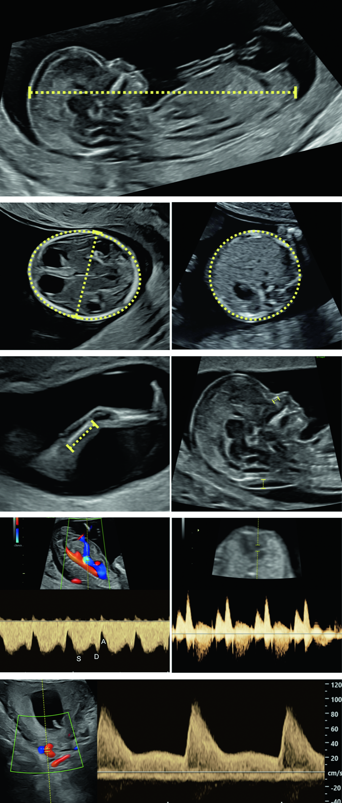
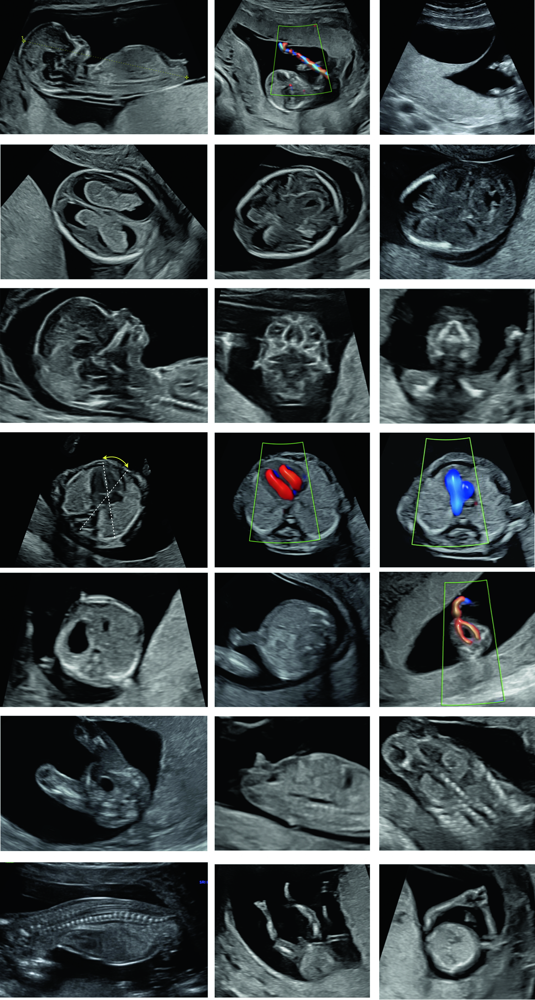
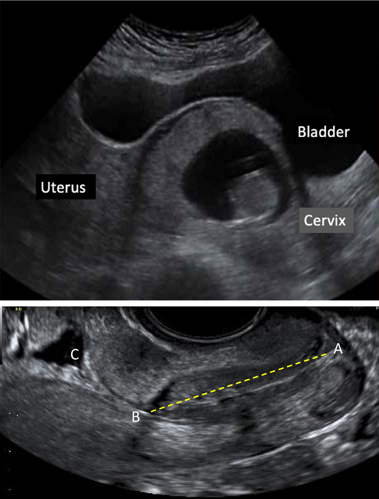

## Tổng quan và Chỉ định

Siêu âm thai quý 1 được thực hiện trong khoảng tuổi thai từ **11 + 0 tuần đến 13 + 6 tuần** (tương ứng với chiều dài đầu-mông CRL từ **45 - 84 mm**). Đây là thời điểm vàng mang tính bước ngoặt trong quản lý thai kỳ, giúp xác định chính xác tuổi thai, đánh giá số lượng thai, sàng lọc dị tật bẩm sinh nặng và dự đoán các biến chứng thai kỳ sớm.

:::note Mục tiêu chính của siêu âm quý 1
- **Xác định sự sống của thai nhi** và đo nhịp tim thai.
- **Xác định tuổi thai chính xác** bằng chiều dài đầu-mông (CRL), thiết lập ngày sinh dự kiến chuẩn xác.
- **Đánh giá đa thai**: Xác định số lượng thai, số lượng bánh nhau (chorionicity) và số lượng buồng ối (amnionicity) - yếu tố quyết định tiên lượng thai kỳ đa thai.
- **Sàng lọc lệch bội nhiễm sắc thể**: Đo khoảng mờ sau gáy (_Nuchal Translucency_ - NT) kết hợp với các dấu hiệu siêu âm bổ sung (xương mũi, Doppler ống thông tĩnh mạch, Doppler van 3 lá).
- **Chẩn đoán dị tật cấu trúc hình thái sớm**: Phát triển khả năng phát hiện các dị tật nặng như thai vô sọ, não thất duy nhất, hở thành bụng, thoát vị rốn.
- **Sàng lọc nguy cơ mẹ**: Sàng lọc nguy cơ tiền giật sớm (_Pre-eclampsia_) và thai chậm phát triển trong tử cung (_Fetal Growth Restriction_ - FGR) bằng Doppler động mạch tử cung.
:::

## Kỹ thuật và Chuẩn bị

### Thiết bị và Đầu dò

- **Đầu dò ngả bụng (TAS):** Lựa chọn ưu tiên hàng đầu với tần số **3.5 - 5.0 MHz**.
- **Đầu dò ngả âm đạo (TVS):** Tần số **5.0 - 9.0 MHz**, được chỉ định khi siêu âm ngả bụng không rõ ràng (ví dụ: mẹ có BMI cao, tử cung ngả sau, sẹo mổ cũ) hoặc cần đánh giá chi tiết cấu trúc tim, não và cổ tử cung.

### Nguyên tắc An toàn Siêu âm

- **Nguyên tắc ALARA:** Luôn tuân thủ nguyên tắc ALARA (_As Low As Reasonably Achievable_ - Mức thấp nhất có thể đạt được một cách hợp lý).
- **Chỉ số nhiệt và chỉ số cơ học:** Giữ chỉ số nhiệt (_Thermal Index_ - TI) **< 1.0** và chỉ số cơ học (_Mechanical Index_ - MI) trong giới hạn an toàn.
- **Sử dụng Doppler:** Tránh sử dụng Doppler xung (_Pulsed-wave Doppler_) kéo dài ở quý 1 trừ khi có chỉ định lâm sàng cụ thể (như đo Doppler động mạch tử cung hoặc ống thông tĩnh mạch) nhằm giảm thiểu năng lượng sóng âm chiếu vào thai nhi.

## Giải phẫu siêu âm bình thường và Sinh trắc học

_Hình "Thực hiện đo các chỉ số sinh trắc và dấu hiệu siêu âm thai quý 1"._

### Chiều dài đầu-mông (CRL)

- **Mặt cắt tiêu chuẩn:** Mặt cắt dọc giữa (_midsagittal view_) toàn bộ thai nhi.
- **Tư thế thai:** Thai nhi ở tư thế trung gian (không quá gập cổ làm giảm kích thước, không quá ngửa cổ làm tăng kích thước).
- **Cách đặt con trỏ (Calipers):** Đặt ở bờ ngoài của cực đầu và cực mông thai nhi (không bao gồm chi hoặc túi lòng đỏ).
- **Ý nghĩa:** CRL là chỉ số chính xác nhất để tính tuổi thai trong thai kỳ (độ chính xác **± 5 ngày**). Nếu CRL trong khoảng **45 - 84 mm**, tuổi thai tính theo CRL sẽ được dùng làm căn cứ pháp lý và lâm sàng duy nhất.

### Đường kính lưỡng đỉnh (BPD) và Chu vi đầu (HC)

- **Mặt cắt tiêu chuẩn:** Mặt cắt ngang đầu thai nhi ở mức đồi thị và não thất bên.
- **Tiêu chuẩn:** Thấy đường giữa cân đối, đám rối màng mạch hình cánh bướm lấp đầy não thất bên.
- **Cách đo BPD:** Đo từ bờ ngoài xương sọ gần đến bờ trong xương sọ xa (_leading-to-leading_ hoặc _outer-to-inner_).
- **Đo HC:** Đo vòng quanh bờ ngoài xương sọ.

### Khoảng mờ sau gáy (NT)

- **Mặt cắt tiêu chuẩn:** Mặt cắt dọc giữa thai nhi, phóng đại hình ảnh sao cho đầu và ngực thai nhi chiếm ít nhất **75%** màn hình.
- **Dấu hiệu định vị:** Thấy rõ chóp mũi, xương hàm trên, não thất IV (khoảng sau não) và màng da gáy độc lập với màng ối.
- **Cách đo:** Đo khoảng tụ dịch echo trống lớn nhất giữa màng da và mô mềm phủ cột sống cổ, đặt con trỏ theo quy tắc "trong-trong" (_on-to-on_). Đo tối thiểu 3 lần và lấy giá trị lớn nhất đạt chuẩn.

_Bảng "Các chỉ số sinh trắc học và mốc siêu âm chuẩn trong quý 1"._

| Chỉ số / Cấu trúc | Kỹ thuật & Mặt cắt chuẩn | Giá trị / Tiêu chuẩn bình thường |
| :--- | :--- | :--- |
| **CRL** | Dọc giữa, thai tư thế trung gian | **45 - 84 mm** (11 + 0 đến 13 + 6 tuần) |
| **BPD / HC** | Ngang đầu qua đồi thị và màng mạch | Đo khi CRL **≥ 84 mm** hoặc hỗ trợ đánh giá sọ |
| **NT** | Dọc giữa phóng đại **≥ 75%** màn hình | **< 3.0 mm** (hoặc **< bách phân vị 95**) |
| **FHR** | Doppler màu / M-mode ngực thai | **140 - 170 lần/phút** |

### Đánh giá Cấu trúc Giải phẫu Thai nhi quý 1

_Hình "Khảo sát cấu trúc giải phẫu thai nhi toàn diện trên siêu âm quý 1"._

:::tip Đánh giá cấu trúc giải phẫu theo danh mục kiểm tra (Checklist)
- **Hộp sọ & Bán cầu não:** Xương vòm sọ liên tục, hai bán cầu não đối xứng, đám rối màng mạch lấp đầy não thất bên tạo hình ảnh "cánh bướm".
- **Khuôn mặt:** Quan sát hai hốc mắt, xương mũi, đường cong liên tục của môi trên và vòm miệng.
- **Cổ:** Khoảng mờ sau gáy NT bình thường, không có nang hạch bạch huyết (_cystic hygroma_).
- **Lồng ngực & Tim:** Lồng ngực cân đối, trục tim quay sang trái **45° ± 20°**, mặt cắt 4 buồng tim cơ bản cân đối, nhịp tim đều.
- **Thành bụng & Cơ quan trong bụng:** Dây rốn cắm vào thành bụng nguyên vẹn (loại trừ thoát vị rốn sau 12 tuần), vị trí bóng dạ dày nằm bên trái dưới cơ hoành.
- **Thận & Bàng quang:** Hai hố thận bình thường, bàng quang hình elip nằm ở vùng tiểu khung.
- **Cột sống:** Trục cột sống liên tục trên mặt cắt dọc và ngang, lớp da phủ nguyên vẹn.
- **Tứ chi:** Quan sát đủ 4 chi, mỗi chi có 3 đoạn (cánh tay, cẳng tay, bàn tay; đùi, cẳng chân, bàn chân).
:::

## Tiêu chuẩn chẩn đoán và Hình ảnh bệnh lý

### Tăng khoảng mờ sau gáy (NT ≥ 3.0 mm)

- **Định nghĩa:** NT **≥ 3.0 mm** hoặc vượt quá **bách phân vị 95** so với chiều dài CRL.
- **Ý nghĩa lâm sàng:**
  - Nguy cơ cao mắc các bất thường nhiễm sắc thể (Trisomy 21, Trisomy 18, Trisomy 13, Hội chứng Turner).
  - Nguy cơ cao mắc dị tật tim bẩm sinh nặng, dị tật xương, thoát vị cơ hoành, dị tật di truyền đơn gen.
  - Tăng tỷ lệ sẩy thai và thai chết trong tử cung.

### Dấu hiệu siêu âm lệch bội bổ sung (Soft Markers quý 1)

- **Xương mũi (Nasal Bone - NB):** Quan sát thấy xương mũi nằm nông hơn lớp da đầu mũi. Vắng mặt xương mũi ở 11–14 tuần xuất hiện ở **60 - 70%** thai nhi Trisomy 21.
- **Dòng chảy qua ống thông tĩnh mạch (Ductus Venosus - DV):** Sóng a ngược chiều (dòng chảy đảo ngược trong thì tâm nhĩ co) là dấu hiệu chỉ điểm nguy cơ cao lệch bội, dị tật tim và tiên lượng xấu.
- **Dòng hở van 3 lá (Tricuspid Regurgitation - TR):** Dòng phụt ngược thì tâm thu qua van 3 lá với vận tốc **> 60 cm/s** liên quan chặt chẽ đến Trisomy 21 và bất thường tim.

_Hình "Doppler sóng a ống thông tĩnh mạch và đánh giá nguy cơ thai kỳ quý 1"._

### Sàng lọc Tiền giật và Thai chậm phát triển (FGR)

- **Chỉ số trở kháng động mạch tử cung (UtA-PI):** Đo Doppler xung động mạch tử cung hai bên ở quý 1. Chỉ số UtA-PI trung bình tăng cao phản ánh sự xâm nhập bất thường của tế bào nuôi vào động mạch xoắn.
- **Mô hình phối hợp ISUOG / FMF:** Kết hợp UtA-PI, Huyết áp động mạch trung bình (MAP), PGF (Placental Growth Factor) và đặc điểm mẹ giúp phát hiện **> 75%** các trường hợp tiền giật xuất hiện trước 37 tuần.

:::danger Các bất thường cấu trúc nguy hiểm cần phát hiện ngay ở quý 1
- **Thai vô sọ (Anencephaly / Acrania):** Thiếu vòm sọ, mô não lộ ra ngoài bị thoái hóa.
- **Não thất duy nhất (Holoprosencephaly):** Không phân chia bán cầu đại não, đường giữa biến mất.
- **Thoát vị rốn (Omphalocele) & Hở thành bụng (Gastroschisis):** Khối thoát vị chứa gan/ruột ra ngoài thành bụng sau 12 tuần.
- **Thai trong sẹo mổ lấy thai (Cesarean Scar Pregnancy - CSP):** Túi thai bám vào vị trí khuyết sẹo mổ cũ, nguy cơ vỡ tử cung và chảy máu đe dọa tính mạng.
:::

## Xảo ảnh và Hạn chế

### Xảo ảnh và Cạm bẫy thường gặp

- **Nhầm lẫn màng ối với màng da gáy:** Trước 14 tuần, màng ối chưa dính hoàn toàn vào màng đệm. Cần chờ thai nhi di chuyển hoặc yêu cầu bệnh nhân ho nhẹ để phân biệt rõ da gáy và màng ối.
- **Thoát vị rốn sinh lý:** Trước 11 tuần (CRL **< 45 mm**), ruột thai nhi nhô vào chân dây rốn là hiện tượng sinh lý bình thường. Chỉ chẩn đoán thoát vị rốn khi khối thoát vị tồn tại sau 12 tuần (CRL **≥ 45 mm**).
- **Tư thế thai nhi gập cổ quá mức:** Làm giảm giả tạo khoảng mờ sau gáy NT. Ngược lại, tư thế ngửa cổ quá mức làm tăng giả tạo NT.

### Hạn chế của Kỹ thuật

- **Trọng lượng cơ thể mẹ (BMI cao):** Lớp mỡ bụng dày làm giảm độ phân giải hình ảnh siêu âm ngả bụng. Khi đó cần kết hợp siêu âm ngả âm đạo.
- **Sự phát triển hoàn thiện muộn của một số cơ quan:** Một số dị tật như hẹp eo động mạch chủ, nhẵn não, bất thành thể callosum hoặc hẹp môn vị không thể chẩn đoán được ở quý 1 do các cấu trúc này chưa hoàn thiện giải phẫu.

## Tài liệu tham khảo

- Chaoui R, Hyett J, Kagan KO, Karim JN, Papageorghiou AT, Poon LC, Salomon LJ, Syngelaki A, Nicolaides KH (2023) - _ISUOG Practice Guidelines (updated): performance of 11–14-week ultrasound scan_. Ultrasound in Obstetrics & Gynecology, 61(1), 127-143. [https://doi.org/10.1002/uog.26106](https://doi.org/10.1002/uog.26106)
- Salomon LJ, Alfirevic Z, Bilardo CM, Chalouhi GE, Ghi T, Kagan KO, Lau TK, Papageorghiou AT, Raine-Fenning NJ, Stirnemann J, Suresh S, Tabor A, Timor-Tritsch IE, Toi A, Yeo G (2013) - _ISUOG Practice Guidelines: performance of first-trimester fetal ultrasound scan_. Ultrasound in Obstetrics & Gynecology, 41(1), 102-113.
- Ministry of Health Vietnam (2020) - _Hướng dẫn quy trình kỹ thuật chuyên ngành Sản Phụ khoa_.
